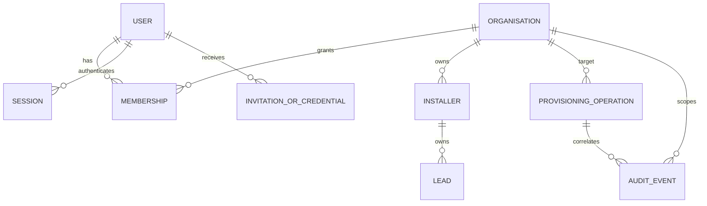
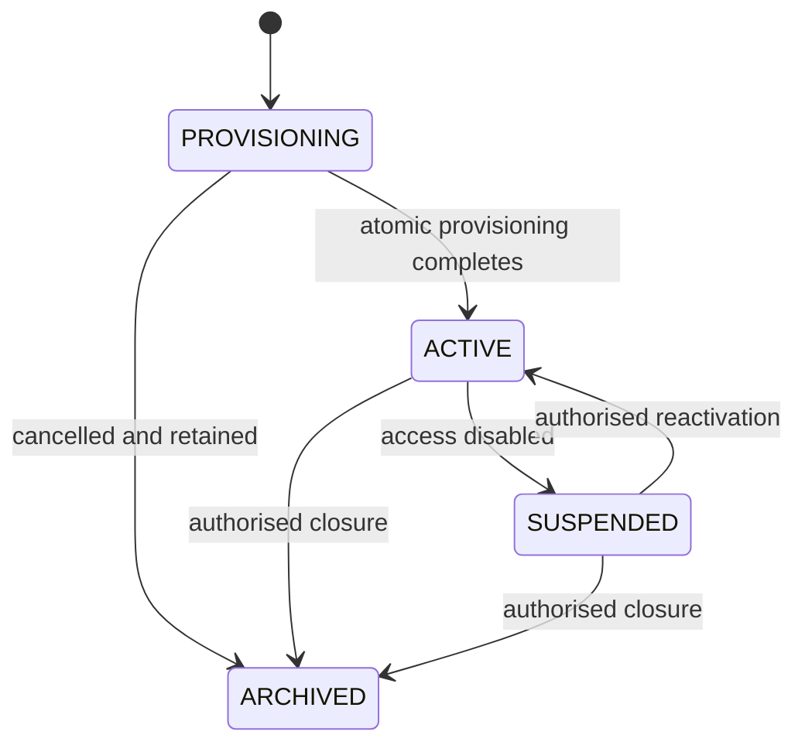
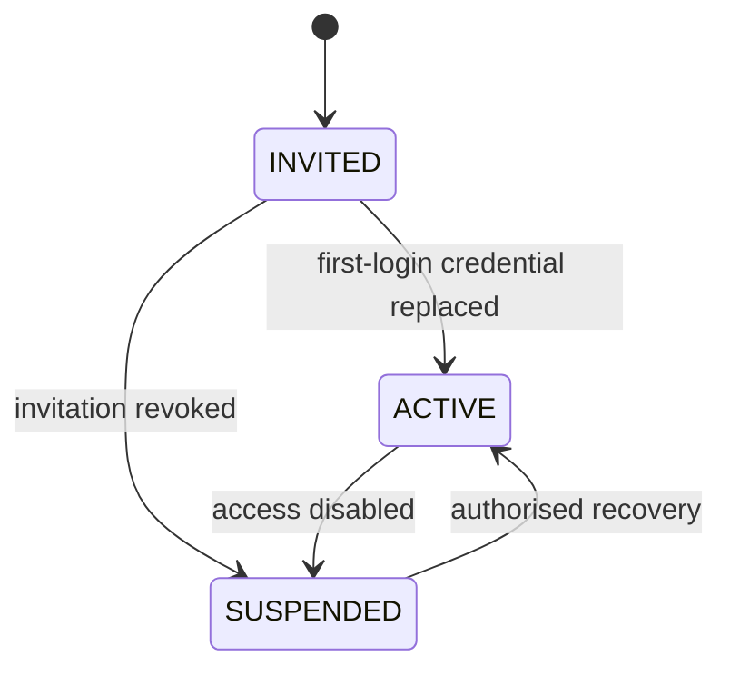
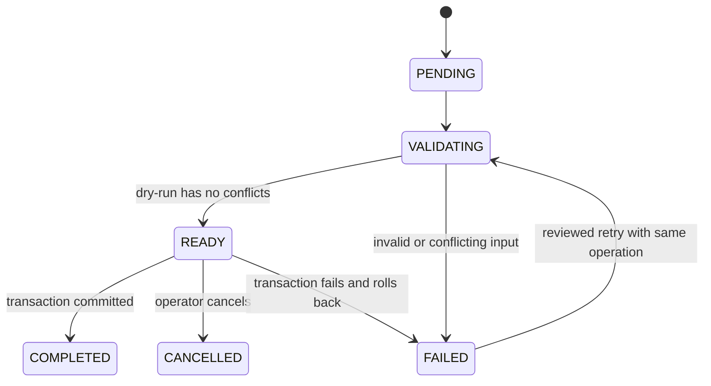

# Clada OS Tenant Provisioning Architecture

| Field | Value |
| --- | --- |
| Document ID | PLAT-TENANT-PROVISIONING-001 |
| Status | Proposed |
| Owner | Clada Systems Architecture |
| Review cycle | Before each provisioning or identity release |
| Last reviewed | 2026-07-17 |

## Purpose and authority

This document defines the approved target architecture for organisation provisioning, identity lifecycle, first-login security, tenant isolation, and operational controls in Clada OS. It is documentation-only: proposed fields, states, commands, routes, and events do not exist until implemented and verified.

Implementation is governed by [ADR-0019](../05-decisions/ADR-0019-standardised-tenant-provisioning.md). Product operation is defined by the [SolarGRANT Pro pilot onboarding runbook](../03-engineering/SOLARGRANT_PRO_PILOT_ONBOARDING_RUNBOOK.md).

Delivery follows: Problem -> Architecture -> ADR -> Implementation -> Verification -> Production. A major platform feature must not skip these gates. An operational task is incomplete until it has a documented, repeatable process.

## Platform and product boundary

Clada OS owns reusable identity, authentication, users, organisations, memberships, roles, permissions, tenant context, provisioning, sessions, audit events, notification foundations, shared security controls, and shared operational tooling. Future billing, integrations, entitlements, and shared UI foundations also belong to Clada OS.

SolarGRANT Pro consumes those capabilities. It owns solar-installer CRM, homeowner intake, grant eligibility, SEAI workflows, quotes, installer pipelines and documents, application packs, follow-up workflows, and installer reporting. SolarGRANT Pro must not create a parallel identity or provisioning model.

### Core concepts

| Concept | Boundary |
| --- | --- |
| User | Global human identity. It does not own tenant leads. |
| Organisation | Clada OS tenant and commercial customer boundary. |
| Membership | User-to-organisation access grant, status, role, and owner semantics. |
| Installer | SolarGRANT Pro business entity owned by one organisation. |
| Session | Authenticated user context resolved to an active membership and tenant context. |
| Audit event | Immutable operational evidence for a security- or tenant-sensitive action. |
| Provisioning operation | Idempotent record of one approved onboarding request and its outcome. |
| Invitation/credential state | Time-limited first-login authority; never a general tenant identity. |

Removing or suspending a user does not delete organisation data. Replacing an owner does not move leads or installers. Clada internal administration is separate from customer membership. Every protected SolarGRANT Pro route and query derives access from authenticated membership; a URL, form field, or request-body tenant identifier is never sufficient authority.

## Current implementation and target gaps

The current schema is the source of truth for implemented behaviour.

| Area | Implemented now | Approved target; not implemented |
| --- | --- | --- |
| Organisation | `Organisation` has unique slug, `INSTALLER`/`CLADA_INTERNAL`, `ACTIVE`/`INACTIVE`, and `verified`. | `PROVISIONING`, `ACTIVE`, `SUSPENDED`, `ARCHIVED`; explicit lifecycle enforcement. |
| User | Unique normalised email, display name, optional Argon2id hash, `ACTIVE`/`INACTIVE`, last login. | `INVITED`, `ACTIVE`, `SUSPENDED`; first-login and credential-expiry fields. |
| Membership | Unique `(organisationId,userId)`, status, `isOwner`, platform role. A separate unique `userId` enforces exactly one membership per user. | A user may belong to multiple organisations; active-owner invariant; membership lifecycle and tenant selection. |
| Installer | Belongs to an organisation; ID is currently deterministic in pilot provisioning. No installer slug field exists. | Validated product-tenant identity/slug or a documented mapping; one or more product tenants per organisation. |
| Session | Opaque random token, HMAC-SHA-256 digest in `AuthSession`, 12-hour expiry, server-side context checks, logout deletion. | Restricted first-login session, rotation after password change, and all-session invalidation rules. |
| Audit | `AuditLog` supports actor, organisation, resource, outcome, timestamp, and sanitised metadata. | Provisioning/credential lifecycle event catalogue and operation correlation. |
| Provisioning | `pnpm pilot:provision` uses guarded environment variables and one Prisma transaction with upserts. | Dry-run-first command, operation record, strict conflict plan, audit, credential expiry, safe delivery, retries, and smoke tests. |
| Password | Argon2id; minimum 12 characters; generic invalid-login response. | Maximum length, weak/compromised-password checks, rate limiting, reset, forced change, and rotation. |

The current provisioning command can update an existing organisation, identity, password, membership, and installer. It accepts plaintext input through an environment variable. It has no dry-run, `mustChangePassword`, credential expiry, provisioning operation, or provisioning audit sequence. It must not be used as evidence that this target feature is ready.

## Domain model



Target cardinality permits one user to have many memberships and one organisation to have many users. One membership joins exactly one user and one organisation. An organisation may own multiple product-specific tenant entities; SolarGRANT Pro initially uses `Installer`. Normal operation requires at least one active `ORGANISATION_OWNER`. Owner semantics remain on membership (`role`, with `isOwner` retained only while compatibility requires it). Leads remain attached to their organisation and installer through user and owner changes.

Migration implications are deferred to the implementation PR: lifecycle columns/enums, credential state, a provisioning-operation model, audit correlation, and suitable uniqueness/index constraints are required. The global unique membership `userId` must be deliberately removed before multi-organisation membership is enabled. No schema change is made by this document.

## Proposed lifecycles







`INVITED` with `mustChangePassword=true` becomes `ACTIVE` only after a successful password change sets `mustChangePassword=false` and clears credential expiry. `ACTIVE -> INVITED`, `ARCHIVED -> ACTIVE`, `COMPLETED -> READY`, and silent owner removal that leaves zero active owners are invalid. Reopening archived tenants, changing a completed operation's inputs, or repairing owner invariants requires explicit review and a separately audited recovery operation.

## Provisioning transaction

The standard service must:

1. Accept approved operator input and validate operator authority and environment.
2. Normalise and validate email, organisation name, installer display name, and slug.
3. Resolve existing user, organisation, installer, and membership records.
4. Classify compatible reuse, exact no-op, repairable state, and blocking conflict.
5. Produce a dry-run plan bound to a canonical input digest and operation ID.
6. Require explicit Production confirmation of that exact plan.
7. Begin one database transaction.
8. Create the organisation and Installer, or reuse only records approved by the plan.
9. Create or safely reuse the user and create the owner membership.
10. Create invitation state or generate a cryptographically secure temporary credential, hash it, set `mustChangePassword=true`, and set expiry.
11. Write transaction-critical audit events and mark the operation completed.
12. Commit and return a secret-free result.
13. Run read-only smoke tests.

All database changes are atomic. Any database or transaction-critical audit failure rolls back the operation. Post-commit notification or credential-delivery failure must not roll back identity data; it records a non-secret failure and leaves the credential undisclosed or revoked, then uses an audited reset/reissue operation. A transactional outbox is preferred when notifications are automated. For the first pilot, audit records that prove the database mutation belong inside the main Prisma transaction; delivery events may follow through an outbox.

## Idempotency and conflict policy

The operation ID should be an operator-supplied idempotency key or a deterministic identifier over canonical environment, organisation slug, installer identity, normalised owner email, and approved request reference. A dry-run stores or emits a plan digest; execution rejects any input whose digest differs.

| Condition | Result |
| --- | --- |
| New email and all names/identifiers free | Create. |
| Email exists with no membership | Stop for review; reuse only after identity verification. |
| Email exists in same organisation with exact active owner membership | No-op if the completed operation matches; otherwise review. |
| Email exists in another customer organisation | Stop for review; multi-organisation access is not a pilot default. |
| Email belongs to Clada internal account | Stop; never add automatically to a customer organisation. |
| Organisation name exists but identity is not exact | Stop for review. |
| Organisation slug exists for the exact target | Reuse/no-op only if all ownership attributes match. |
| Installer ID/slug exists for exact organisation | Reuse/no-op if exact; otherwise conflict. |
| Membership already exists with a different role/status | Stop for review; never silently promote or move it. |
| Existing organisation has no active owner | Repair only through an explicitly approved owner-recovery operation. |
| Previous operation failed before commit | Database is unchanged; retry same key after cause is fixed. |
| Command runs twice or after completion | Return the prior safe result; create nothing. |
| Dry-run and execution differ | Reject and require a new dry-run. |

No path silently duplicates or reassigns users, organisations, installers, memberships, or owners. Ambiguity always stops.

## Proposed command contract

```text
pnpm provision:organisation -- \
  --organisation-name "Harbour Solar Ltd" \
  --owner-name "Aoife Byrne" \
  --owner-email "aoife@harbour-solar.example" \
  --installer-name "Harbour Solar" \
  --installer-slug "harbour-solar" \
  --approved-by "approved-operator-id" \
  --environment "production" \
  --idempotency-key "pilot-2026-001" \
  --dry-run
```

Required: organisation name, owner full name, owner email, installer display name, explicit or deterministically generated installer slug, approved-by identifier, environment, and Production idempotency key. Optional: phone, external customer reference, cohort, non-sensitive notes, and credential expiry. Safety flags are `--dry-run`, `--confirm-production`, and `--idempotency-key`.

Names are trimmed, bounded, and checked for control characters; email is trimmed, lower-cased, and validated; slugs are lower-case kebab-case and bounded; environment is an allow-listed value; approvals use durable operator identifiers, not display names. Credential expiry defaults to 24 hours and cannot exceed an approved pilot maximum without a reason.

The command defaults to dry-run. Production writes require a matching prior plan, `--confirm-production`, database fingerprint verification, and an approved change/reference. It must refuse interactive ambiguity and must not read secrets from ordinary command arguments.

Safe output contains operation ID/status, canonical non-secret inputs, planned actions, conflict/reason codes, record IDs after commit, expiry status (not the secret), audit confirmation, and smoke-test results. Output must never contain credential/token material, hashes, cookies, headers, connection strings, or environment values.

| Exit | Meaning |
| --- | --- |
| 0 | Dry-run ready, completed, or idempotent no-op. |
| 2 | Input validation failed. |
| 3 | Conflict requires operator review. |
| 4 | Environment/authorisation/confirmation denied. |
| 5 | Transaction failed and rolled back. |
| 6 | Post-commit delivery or verification failed; recovery required. |

Retries use the same idempotency key and immutable inputs. A changed request uses a new key and approval. Every request, plan, denial, commit, and failure is audited without secrets.

## Temporary credential policy

Temporary passwords are an interim pilot mechanism. A credential is generated from a cryptographically secure source, meets the password policy, is hashed before storage, expires by default after 24 hours, and becomes invalid after password change, reset, suspension, or expiry. A 72-hour exception may reduce operator reissues but increases exposure and requires an approved reason. Login attempts must be rate-limited.

Plaintext credentials must never enter source, PRs, commits, documentation examples, chat/Codex summaries, audit/application/CI/deployment logs, screenshots, or persisted terminal output. Email may carry the login URL and account email, while the credential uses a separate approved channel such as a verified phone call or controlled secure message.

The repository currently has no approved non-logged secret handoff integration. Production execution is therefore blocked until implementation provides one of:

- direct write to an approved one-time secret-delivery service, returning only a non-secret delivery receipt; or
- an operator-controlled, non-recorded interactive handoff whose process has been security-approved and tested.

The command must never print the credential as a fallback. The preferred replacement is a one-time, time-limited signed invitation that lets the user choose a password and exposes no password to the operator.

## First-login authentication flow

```mermaid
sequenceDiagram
    participant O as Owner
    participant A as Auth service
    participant D as Clada OS data
    participant P as SolarGRANT Pro
    O->>A: Email + temporary credential
    A->>D: Verify credential, user, organisation, membership, expiry
    D-->>A: Valid; mustChangePassword=true
    A-->>O: Restricted first-login session + password-change route
    O->>P: Attempts product/API route
    P-->>O: Denied or redirected; no tenant data
    O->>A: Current credential + new password + confirmation
    A->>D: Transaction: replace hash, activate, clear expiry, audit
    A->>D: Revoke restricted/all prior sessions
    A-->>O: New rotated normal session
    O->>P: Dashboard request
    P->>D: Tenant-scoped query from membership
    D-->>P: Truthful empty tenant data
```

After credential verification, authentication checks user, organisation, and membership status plus expiry and `mustChangePassword`. It issues only a restricted session and redirects to a dedicated password-change route. Dashboard, leads, quotes, admin, intake-management, API, and session-refresh routes reject restricted users; HTML routes redirect and protected APIs return a generic `403` code such as `PASSWORD_CHANGE_REQUIRED` without tenant data. Only logout, password change, and narrowly required session endpoints are allowed.

Password change verifies the current credential, new policy, and confirmation; replaces the hash; clears the flag and expiry; activates the invited user; revokes prior sessions; rotates to a new normal session; and writes audit events. Manual URLs cannot bypass a server-side guard.

Expired credentials fail generically and require audited reissue. Suspended user, membership, or organisation fails generically and creates no session. Closing the browser leaves the restricted state and permits resumption only while credential/session is valid. Validation errors retain no new password and reveal clear policy guidance. Session expiry requires re-authentication. A replaced temporary credential never works again.

## Password and session policy

Current implementation uses `@node-rs/argon2` Argon2id with memory cost 19,456 KiB, time cost 2, parallelism 1, 32-byte output, and library-managed salts. Minimum length is 12 characters. Authentication uses a dummy hash for unknown users, returns a generic `401` for invalid credentials, stores only HMAC-SHA-256 session-token digests, checks account/tenant state on context resolution, expires sessions after 12 hours, and deletes the current session on logout.

Not currently implemented: maximum length, breached/weak-password screening, login rate limiting/lockout, temporary expiry, forced change, password reset, password-change route, and automatic all-session rotation/invalidation.

Target policy keeps Argon2id unless a reviewed benchmark changes its parameters; uses unique library-generated salts; requires at least 12 characters and supports at least 64 (recommended input maximum 128 to bound resource use); requires confirmation; rejects common/obvious and context-derived passwords; and uses privacy-preserving compromised-password detection if feasible. Responses remain generic. Rate limits apply per account and network signal without enabling account discovery. Password reset and change revoke prior sessions and rotate the active session.

## Roles and access

The pilot provisions only `ORGANISATION_OWNER`. It permits access to the member organisation and Installer, SolarGRANT Pro tenant workflows, allowed organisation details, and tenant-owned leads. Future staff management requires a separately implemented permission.

It never permits Clada internal administration, another organisation/Installer, arbitrary public membership creation, secret access, suspension bypass, forced-change bypass, or access by altered identifiers. Future conceptual roles are `ORGANISATION_ADMIN`, `SALES_USER`, `OPERATIONS_USER`, and `READ_ONLY`; they require a later role mapping/ADR because current `PlatformRole` names differ.

## Tenant isolation invariants

- Authenticated active membership is the authorisation source.
- All tenant queries constrain trusted organisation and, where applicable, Installer.
- `installerId` from URL/body is an identifier to validate, never authority.
- New tenants start with zero leads, no copied or synthetic data, and no fallback metrics.
- Dashboard values derive only from persisted tenant data.
- Intake links resolve to the intended Installer; public submissions create leads only for that Installer and organisation.
- Customer owners are never automatically added to `org_clada_internal`; internal accounts do not gain customer access implicitly.

Tests must cover guessed IDs, cross-tenant reads/writes/exports, child resources, altered installer IDs, internal-role non-bypass, empty dashboards, intake isolation, and absence of Demo Solar data.

## Audit architecture

Required event types are `PROVISIONING_REQUESTED`, `PROVISIONING_DRY_RUN_COMPLETED`, `ORGANISATION_CREATED`, `INSTALLER_CREATED`, `USER_CREATED`, `USER_REUSED`, `MEMBERSHIP_CREATED`, `OWNER_ASSIGNED`, `TEMPORARY_CREDENTIAL_CREATED`, `INVITATION_CREATED`, `PROVISIONING_COMPLETED`, `PROVISIONING_FAILED`, `FIRST_LOGIN_COMPLETED`, `PASSWORD_CHANGED`, `USER_ACTIVATED`, `CREDENTIAL_EXPIRED`, `CREDENTIAL_RESET`, `USER_SUSPENDED`, `USER_REACTIVATED`, `ORGANISATION_SUSPENDED`, `ORGANISATION_REACTIVATED`, and `ORGANISATION_ARCHIVED`.

Events carry type, timestamp, actor, target organisation/Installer/user, operation ID, result, reason code, resource IDs, and minimal non-secret metadata. They never carry plaintext credentials, hashes, cookies, tokens, keys, URLs with secrets, database URLs, or full sensitive request payloads. Database-mutation events are written inside the main transaction for pilot scope. Notification delivery should move to a transactional outbox when automated.

## Failure, rollback, and recovery

Validation, duplicates, incompatible membership, unauthorised environment, and input errors fail before writes. Database, credential-generation-before-storage, or transaction-critical audit failure rolls back everything. Post-commit session, delivery, deployment, or smoke-test failure preserves committed data, suspends or revokes access when risk requires it, and opens an audited repair action.

Corrections to names are audited updates. Wrong owner email before activation revokes the credential and uses a reviewed replacement operation; after activation it requires identity/owner-transfer review. Owner replacement adds and verifies the replacement before removing/suspending the former owner. Pilot cancellation suspends access and archives the organisation where appropriate.

Rollback means an uncommitted transaction leaves no state. Repair means an audited correction to retained state. Suspension blocks access without destroying data. Archive closes normal operation while retaining records. Deletion is exceptional, privacy/legal-reviewed, and never the default support response. Manual review is mandatory for identity reuse, cross-organisation membership, internal accounts, owner invariant repair, post-commit verification failure, owner replacement, archival reversal, and deletion requests.

## Safe Codex output contract

Codex may report organisation/Installer names and IDs, owner name/email, role, operation ID/status, intake URL, forced-change and expiry status, smoke/audit confirmation, and deployment status. It must not report any password, hash, reset/invitation token, cookie, database URL, API/Vercel/Neon secret, environment contents/value, or authentication header. Credential delivery happens through the approved handoff, not Codex output. Absence of that mechanism is a blocker.

## Roadmap

1. Pilot tooling: repository command, Codex-operated dry-run and confirmation, temporary credential, forced change, audit, manual secure delivery.
2. Clada internal administration: authenticated internal UI for create/invite/reissue/suspend/reactivate/history/audit/owner management without direct database access.
3. Self-service invitation: one-time signed token, user-selected password, optional email verification, expiry/resend, automated communication, no operator-visible password.
4. Platform onboarding: reusable product entitlements, billing, settings, staff invitations, granular roles, and SSO only when commercially justified.

## Related documents

- [Platform architecture](README.md)
- [SolarGRANT Pro module](../01-product/SOLARGRANT_PRO_MODULE.md)
- [Pilot authentication](../03-engineering/PILOT_AUTHENTICATION.md)
- [Implementation plan](../03-engineering/TENANT_PROVISIONING_IMPLEMENTATION_PLAN.md)
- [Tenant-aware data access ADR](../05-decisions/ADR-0005-tenant-aware-data-access.md)
- [Audit ADR](../05-decisions/ADR-0009-actor-aware-audit-model.md)
- [Pilot authentication ADR](../05-decisions/ADR-0018-pilot-installer-authentication.md)
