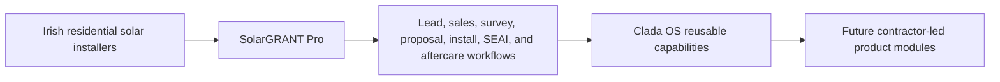
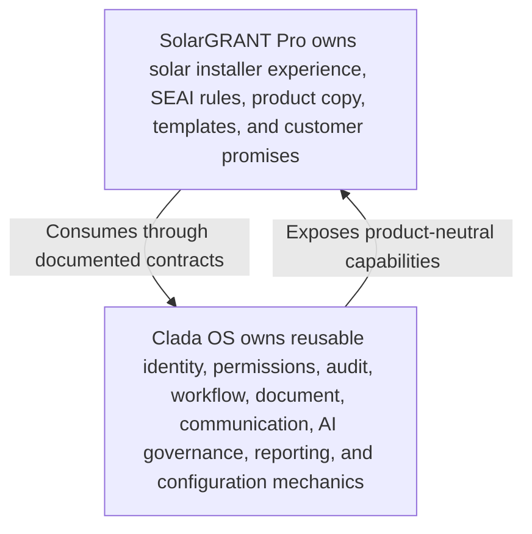

# SolarGRANT Pro - Product Strategy And Roadmap v1.0

| Field | Value |
| --- | --- |
| Document ID | PROD-SGP-STRATEGY-ROADMAP-001 |
| Status | Proposed |
| Owner | Clada Systems Product |
| Review cycle | Quarterly |
| Last reviewed | 2026-07-14 |
| Version | v1.0 |

This document defines the long-term product strategy for SolarGRANT Pro.

It is not a sprint plan, feature specification, implementation plan, release specification, or commitment to build every capability immediately. It is the strategic product reference that future SolarGRANT Pro feature specifications, release plans, pilot decisions, sales decisions, and customer research should align with.

## Executive Summary

SolarGRANT Pro is the first commercial product module built on Clada OS. It serves Irish residential solar installers by connecting lead capture, qualification, customer communication, quote preparation, document collection, grant workflow support, installer review, and operational visibility into one coherent product experience.

The product exists because many installer businesses operate in the gap between fragile manual tools and heavyweight generic software. Their work is not only sales pipeline management. It includes customer education, grant readiness, site information, documents, handoffs, follow-up, installation coordination, aftercare, and trust-sensitive records. SolarGRANT Pro should reduce that operational drag without forcing installers into enterprise process before they are ready.

The commercial opportunity is to become the operating platform for modern Irish residential solar installers. Grant automation is one capability within that platform, not the whole product. SolarGRANT Pro should begin by making the sales-to-grant workflow faster and more reliable, then expand into the broader installer operating layer as customer evidence proves the workflow.

The long-term vision is for SolarGRANT Pro to be the system an installer opens each morning to understand which leads need attention, which customers are blocked, which documents are missing, which proposals need follow-up, which jobs are ready for installation, which grant steps require human review, and which business metrics are improving or deteriorating.

## Strategy Diagrams

### Product Destination

### Customer Journey

### Platform Boundary

## Mission

SolarGRANT Pro helps Irish residential solar installers convert demand into completed, trusted customer outcomes by reducing administration, improving follow-up, organising grant-related work, and giving installer teams one operational source of truth from lead capture through aftercare.

## Vision

SolarGRANT Pro becomes the operating platform for modern Irish residential solar installers.

In this future, the product is not only a grant assistant. It is the installer business layer that coordinates leads, customers, surveys, proposals, contracts, installation work, SEAI grant readiness, documents, communications, team tasks, reporting, and human-reviewed automation.

Grant automation remains important, but it is only one part of a complete operating platform. The durable product advantage comes from connecting grant expertise to the wider installer journey.

## Product Positioning

### Current Positioning

SolarGRANT Pro is currently positioned as the first Clada OS product module for Irish solar installers, with working capability around homeowner intake, eligibility checks, lead scoring, installer review, CRM-style pipeline stages, customer portal links, document uploads, quote estimates, application-pack preparation, notifications, audit records, organisation ownership, permissions, and workflow-backed stage changes.

Current positioning should be calm and specific:

- SolarGRANT Pro helps Irish solar installers manage lead qualification, quote readiness, customer documents, grant-related review, and follow-up.
- It supports human-reviewed workflows; it does not claim to submit grants automatically or replace installer judgement.
- It is a product module on Clada OS, not the whole platform.

### Future Positioning

SolarGRANT Pro should evolve from grant workflow support into the operating platform for Irish residential solar installers.

Future positioning should describe a complete installer workflow:

- capture and qualify demand;
- manage customer and sales pipeline context;
- support site survey and design readiness;
- generate proposals and document packs;
- coordinate contracts, installation, grant administration, and aftercare;
- use automation and AI to reduce repetitive work while preserving human accountability.

### Competitive Differentiation

SolarGRANT Pro should differentiate by operational depth rather than feature volume.

| Differentiator | Strategic meaning |
| --- | --- |
| End-to-end installer workflow | The product connects lead, customer, document, quote, grant, installation, and aftercare work instead of becoming another disconnected point tool. |
| Irish grant workflow expertise | SEAI-specific checks, documents, warnings, and customer communication live in the product where they belong. |
| Practical automation | Automation reduces duplicate work and missed follow-up without hiding consequential decisions from humans. |
| Installer experience | The product is designed for owner-led and operations-led installer teams with limited time and mixed digital maturity. |
| Homeowner experience | Clear status, document requests, and communication improve installer reputation. |
| Clada OS advantage | SolarGRANT Pro can compound through reusable platform capabilities instead of rebuilding identity, workflow, audit, documents, communications, AI governance, and reporting in isolation. |

## Target Customers

SolarGRANT Pro should serve several installer segments without assuming they all need the same workflow depth on day one.

| Segment | Pain points | Digital maturity | Buying motivations | Success metrics |
| --- | --- | --- | --- | --- |
| Sole traders | Missed calls, weak follow-up discipline, limited admin time, grant document confusion, customer questions handled from memory. | Often spreadsheet, inbox, phone, and messaging app led. Low appetite for setup. | Save owner time, look more professional, avoid losing good leads, make grant steps easier to explain. | Faster lead response, fewer missed follow-ups, simple customer document collection, repeat weekly use by the owner. |
| Small installers | Leads and documents scattered across a small team, unclear handoffs, inconsistent qualification, quote delays, admin bottlenecks. | Mixed CRM use; often still dependent on spreadsheets and manual checklists. | Improve conversion, reduce admin pressure, create shared visibility, support one or two dedicated admin or sales users. | Quote turnaround, lead-to-survey conversion, grant readiness time, fewer duplicate records, fewer customer chasers. |
| Regional installers | Multi-crew coordination, larger pipeline, handoffs between sales, survey, admin, installation, and management, inconsistent status reporting. | Some formal systems, but solar grant and document workflows may sit outside them. | Operational control, standardised process, management reporting, team accountability, scalable customer experience. | Pipeline ageing, survey throughput, proposal win rate, installation readiness, document completion rate, role-based adoption. |
| National installers | Multiple teams, territories, quality controls, reporting needs, support requirements, privacy and governance expectations. | Higher system expectations and existing tools; integration and controls matter. | Standard operating model, visibility across teams, data governance, predictable onboarding, reporting, support, integration potential. | Revenue per installer, SLA adherence, conversion rate by channel or region, support burden, audit coverage, customer satisfaction. |

### Customer Segment Guidance

SolarGRANT Pro should win early trust with sole traders and small installers through speed, simplicity, and visible admin relief. It should mature toward regional and national installers by adding governance, configuration, reporting, support, integration boundaries, and operational controls.

The product should not overfit to national-installer complexity before the smaller segments prove the core workflow. It should also avoid remaining so lightweight that regional installers cannot standardise on it.

## Core Product Principles

| Principle | Product guidance |
| --- | --- |
| Reduce administration | Every major feature should remove a repeated manual action, reduce chasing, simplify handoff, or make review faster. |
| Eliminate duplicate work | Customer, lead, document, quote, workflow, and communication data should be captured once and reused safely. |
| One source of truth | SolarGRANT Pro should be the operational record for installer-facing lead, customer, document, grant, and workflow state. |
| Mobile-first workflows | Field work should be easy on phones and tablets before advanced desktop-only controls are prioritised. |
| Automation before manual work | Use automation for reminders, status propagation, document readiness, summaries, and task prompts where the rules are clear. |
| AI assists rather than replaces judgement | AI can draft, summarise, prioritise, and flag risk. Humans remain accountable for eligibility, proposals, contracts, grant submissions, and customer commitments. |
| Customer data belongs to the installer | SolarGRANT Pro must preserve installer ownership, privacy, exportability, and trust over customer records. |
| Platform before product-specific shortcuts | Reusable identity, workflow, document, communication, audit, reporting, configuration, and AI governance mechanics belong in Clada OS where evidence supports reuse. |
| Reliable software over flashy software | Installer teams should trust the product in daily work. Speed, clarity, data integrity, auditability, and predictable behaviour matter more than novelty. |
| Practical adoption | The product should create value before demanding perfect process maturity from the installer. |
| Human-review checkpoints | Grant, finance, legal, customer-facing, and compliance-sensitive outputs require explicit human review before consequential use. |

## Complete Customer Journey

The product roadmap should be organised around the installer journey rather than isolated feature categories.

| Stage | Purpose | Current capability | Future capability | Success measures |
| --- | --- | --- | --- | --- |
| 1. Marketing and Lead Capture | Convert homeowner demand into structured installer-ready enquiries. | Public intake page, embeddable intake route, validated lead form, consent capture, optional uploads, duplicate submission protection, email and SMS notification hooks. | Channel attribution, installer-branded forms, partner forms, lead-source reporting, campaign-quality signals, controlled routing by installer or territory. | Lead submission completion rate, lead source quality, response SLA, duplicate rate, consent capture completeness. |
| 2. Qualification | Decide whether the lead deserves fast sales attention, manual grant review, or disqualification. | Rules-based eligibility, optional AI-enhanced summary, lead score, MPRN and grant risk flags, quote estimate, generated installer quote values. | Configurable qualification rules, richer grant readiness scoring, exception queues, installer-specific thresholds, qualification review workflow. | Time to qualified lead, qualification accuracy, manual review rate, hot-lead conversion, fewer unsuitable survey bookings. |
| 3. CRM and Sales Pipeline | Track each opportunity from new lead to won or lost. | Pipeline stages from New Lead to Won/Lost, stage changes through workflow service, follow-up dates, notes, recent activity, dashboard summaries. | Full sales workspace, assignments, tasks, contact history, pipeline ageing, saved filters, team accountability, lost-reason analysis. | Follow-up adherence, lead ageing, conversion by stage, sales activity completion, pipeline value visibility. |
| 4. Site Survey | Capture field evidence needed for design, quote confidence, and grant readiness. | Intake captures roof, electricity usage, property, MPRN, optional photos, and notes. Portal can collect supporting documents. | Mobile survey checklist, roof and meter photos, structured survey notes, site constraints, signature capture, offline draft mode, survey-to-design handoff. | Survey completion rate, missing-site-data rate, resurvey rate, time from qualified lead to completed survey. |
| 5. System Design | Translate survey and usage data into an installer-reviewed system recommendation. | Indicative system size, estimated panels, battery and extras interest, savings and payback estimates. | Design assumptions, selectable system variants, design review workflow, integration-ready design handoff, design version history. | Design turnaround, design rework, quote confidence, customer acceptance of recommended option. |
| 6. Proposal Generation | Produce clear, professional, installer-approved customer proposals. | Quote estimate, installer quote pricing settings, copy-friendly structured summary, application-pack views. | Branded proposals, proposal versions, customer-facing summaries, optional AI drafting under review, proposal sent and viewed states. | Quote turnaround, proposal win rate, proposal revision count, customer questions after proposal. |
| 7. Contract and Acceptance | Capture customer commitment and required acceptance records. | Signed contract can be tracked as a document type. Status fields can mark progress. | Digital acceptance workflow, contract document templates, signature capture, acceptance audit trail, deposit or payment handoff if approved. | Acceptance turnaround, contract completion rate, missing-contract rate, audit completeness. |
| 8. Installation Management | Coordinate handoff from sales and grant readiness into scheduled installation work. | Status options include installation pending and payment document states. Lead detail holds assigned installer and notes. | Calendar, crew assignment, installation checklist, job readiness gate, materials notes, installer mobile updates, exception tracking. | Survey-to-install time, readiness blockers, installation rescheduling, crew handoff completeness. |
| 9. SEAI Workflow | Support grant readiness, documentation, review, and manual submission preparation. | Eligibility checks, risks and missing items, document checklist, customer portal uploads, application-pack JSON, print summary, portal-fill preview, manual-assist notice. | Configurable SEAI checklist, document approval workflow, grant readiness score, customer reminders, reviewed submission pack, post-submission tracking. | Grant completion time, missing document rate, review cycle time, error rate, customer chaser count. |
| 10. Aftercare and Customer Success | Preserve trust after installation and create repeatable customer relationship value. | Basic completion status and customer data records. | Aftercare tasks, warranty and maintenance reminders, monitoring handoff, referral prompts, battery or EV charger upgrade opportunities, customer satisfaction capture. | Customer satisfaction, referral rate, aftercare task completion, upgrade revenue, support volume. |

## Product Modules

| Module | Purpose |
| --- | --- |
| CRM | Manage leads, contacts, opportunities, pipeline stages, follow-ups, assignments, notes, and sales outcomes. |
| Documents | Collect, validate, review, store, and prepare installer and customer documents for proposals, contracts, grant readiness, and aftercare. |
| Communications | Track customer and installer communications, reminders, notifications, templates, delivery status, and communication history. |
| Workflow | Represent state, transitions, handoffs, review queues, blockers, and approvals across the customer journey. |
| Calendar | Schedule callbacks, surveys, installations, follow-ups, deadlines, and aftercare actions. |
| Tasks | Turn workflow needs into owned actions with due dates, priority, status, and escalation. |
| Automation | Reduce repetitive work through rule-based reminders, status changes, document prompts, duplicate detection, and handoff triggers. |
| Reporting | Show operational metrics, bottlenecks, conversion, grant completion, installer productivity, and business outcomes. |
| Customer Portal | Let homeowners view status, upload documents, receive clear instructions, and reduce admin chasers. |
| Installer Portal | Give installer teams a daily workspace for pipeline, documents, proposals, surveys, jobs, and customer context. |
| Administration | Support account setup, roles, permissions, installer settings, data protection requests, audit review, and operational support. |
| AI Assistant | Draft, summarise, prioritise, extract, and explain under human review and platform AI governance. |
| Settings | Configure installer branding, pricing assumptions, qualification thresholds, document checklists, workflow labels, notification templates, and team preferences within approved platform boundaries. |

## Clada OS Mapping

SolarGRANT Pro must remain product-specific where Irish solar, SEAI grants, installer promises, and customer experience are involved. Clada OS must remain reusable where the behaviour can serve multiple contractor workflows.

| SolarGRANT Pro capability | Clada OS platform responsibility | SolarGRANT Pro responsibility | Boundary rule |
| --- | --- | --- | --- |
| Installer account ownership | Organisations, users, memberships, tenant context, status. | Installer-facing account language and onboarding flow. | Platform owns ownership mechanics; product owns installer experience. |
| Lead intake | Intake contracts, validation patterns, duplicate handling, customer record linkage. | Solar grant questions, homeowner copy, installer-branded form decisions. | SEAI-specific questions must not become generic platform fields unless proven reusable. |
| Qualification | Rules engine boundary, review workflow, auditable scoring inputs where reusable. | Grant eligibility rules, Irish solar risk wording, sales priority interpretation. | Platform can own mechanics; product owns grant meaning. |
| CRM pipeline | Workflow instances, transitions, permissions, history, audit events. | Pipeline labels, stage meanings, sales playbook, installer-specific views. | Product configures workflow; platform executes workflow. |
| Customer record | Reusable contact and customer identity model. | Solar customer context, property and grant details. | Customer identity is reusable; MPRN and SEAI data are product-domain data. |
| Site survey | Mobile capture patterns, task/checklist primitives, document/photo capture. | Survey fields, roof/solar constraints, installer survey checklist. | Field workflow mechanics can be platform; survey content is product-specific until reused. |
| System design | Documented design handoff contracts, versioned records if reusable. | Solar system sizing assumptions, panels, batteries, EV chargers, grant-aware quote context. | Technical solar assumptions stay in product or solar domain. |
| Proposal generation | Generated document mechanics, storage, checksum, template versioning, permissions. | Proposal content, quote wording, solar templates, customer promise language. | Platform owns generated document trust; product owns proposal meaning. |
| Contract and acceptance | Document records, signature/acceptance audit mechanics when approved. | Solar contract templates, acceptance wording, installer policy. | Legal/customer commitment wording remains product-owned. |
| Installation management | Tasks, calendar, workflow, notifications, reporting primitives. | Solar installation checklist, crew handoff details, readiness gates. | Platform owns coordination mechanics; product owns solar job requirements. |
| SEAI workflow | Document, workflow, audit, notification, and human-review foundations. | SEAI checklist, grant status language, manual submission prep, portal-fill preview content. | Platform must not import SEAI portal or grant rules as generic concepts. |
| Customer portal | Secure portal foundation, token/access model, document upload mechanics. | Solar project status language, document instructions, homeowner expectations. | Portal security and document mechanics are platform; content is product. |
| Communications | Message request, provider boundary, delivery status, history, audit. | Approved solar/grant copy, reminder purpose, tone, customer timing. | Product controls what is said; platform controls how it is sent and tracked. |
| AI assistance | Traceability, confidence, review status, permissions, provider boundary. | Grant prompts, solar summaries, product-specific drafting instructions. | AI output is advisory until reviewed. |
| Reporting | Metric event sources, aggregation contracts, access control. | Solar KPI interpretation, installer dashboards, grant-specific measures. | Platform owns trusted events; product owns commercial meaning. |
| Settings | Configuration model, validation, permission, audit. | Installer-specific thresholds, labels, templates, pricing inputs, checklist values. | Configuration changes must not fork platform internals. |
| Billing and packages | Account status, usage events, commercial operations when validated. | SolarGRANT Pro packaging, pricing, service tiers, onboarding promises. | Defer billing automation until package assumptions are validated. |

## Product Roadmap

The roadmap is organised by maturity rather than calendar date. A stage is complete only when the product, platform, support model, customer evidence, and commercial operating model are ready for that maturity level.

| Maturity stage | Goals | Major capabilities | Customer outcomes | Technical priorities | Business priorities |
| --- | --- | --- | --- | --- | --- |
| Pilot Ready | Prove that SolarGRANT Pro reliably improves the lead-to-grant-readiness workflow for a small number of installers. | Stable intake, CRM pipeline, eligibility checks, quote estimate, customer portal, document upload, application pack, audit, workflow-backed stage changes, basic onboarding. | Installers respond faster, understand lead quality, collect documents with less chasing, and trust the product for daily review. | Preserve identity, permissions, audit, workflow foundations; harden documents; improve reliability; keep manual assist boundaries clear. | Recruit design-partner installers, define onboarding, capture feedback, prove willingness to use weekly. |
| Commercial Launch | Turn pilot learning into a repeatable paid product for small and regional installers. | Installer onboarding, settings, proposal workflow, document readiness, reminders, task ownership, basic reporting, support playbook, data export. | Teams reduce admin time, quote faster, standardise follow-up, and see pipeline bottlenecks. | Document foundation, notification foundation, module configuration, support tooling, privacy/data controls. | Pricing/package validation, sales collateral, customer success process, renewal and expansion motion. |
| Growth | Support larger teams, higher lead volume, and repeatable operations across multiple installer roles. | Calendar, survey workflow, installation coordination, advanced reporting, configurable workflows, richer customer portal, AI-assisted drafting and prioritisation under review. | Regional installers manage higher volume without proportional admin hiring and gain management visibility. | AI governance, reporting foundation, integration boundaries, performance, observability, role-based controls. | Scale onboarding, partner/channel opportunities, expansion revenue, case studies, support metrics. |
| Market Leader | Become the default operating platform for serious Irish residential solar installers. | End-to-end operating system from demand to aftercare, mature reporting, integrations, package/billing maturity, benchmark insights, expansion modules for adjacent renewable workflows. | Installers run sales, documents, installation, grant, aftercare, and growth decisions from one trusted platform. | Integration framework, billing/commercial operations, enterprise readiness, uptime/backup controls, advanced governance. | Market leadership, ecosystem partnerships, national account readiness, adjacent market expansion. |

### Growth Roadmap View

## Pilot Readiness

Pilot readiness is not measured by feature count. It is measured by whether the product can be trusted commercially at each scale.

| Installer count | Commercial readiness bar | Product and platform readiness | Onboarding and support readiness | Evidence required |
| --- | --- | --- | --- | --- |
| 5 installers | Founder-led pilot with close feedback and manual support. | Core lead, CRM, document, portal, quote, and workflow paths reliable for real use. Manual assist boundaries are explicit. | Hands-on setup, weekly feedback, direct issue triage, clear pilot expectations. | Installers use the product weekly, at least one real workflow is completed end to end, major blockers are understood. |
| 25 installers | Repeatable pilot cohort with basic support process. | Stable onboarding, organisation separation, document review, reminders, dashboard visibility, export and deletion process. | Standard onboarding checklist, support response expectations, training materials, feedback tagging. | Reduced admin effort, improved follow-up, no recurring critical data integrity issues, clear pricing signal. |
| 100 installers | Early commercial scale with operational support and product controls. | Module configuration, reporting, notification reliability, data protection process, role clarity, performance at volume. | Customer success playbook, issue severity process, onboarding analytics, customer health reviews. | Retention signal, conversion or admin-time improvement, support volume under control, clear package fit. |
| 500 installers | Mature commercial operation supporting larger teams and high lead volumes. | Strong observability, backups, integration boundaries, advanced reporting, enterprise controls, billing/package readiness. | Scaled support, account management, migration/import process, service commitments, documented operational policies. | Predictable gross retention, expansion opportunities, stable uptime, audit-ready customer data handling, proven support economics. |

## AI Strategy

AI should make installer work faster, clearer, and safer. It should not become the product story, and it must not make consequential decisions without human review.

| AI area | Practical capability | Human review rule | Maturity path |
| --- | --- | --- | --- |
| Sales assistance | Draft lead summaries, next-best-action prompts, objection summaries, and call preparation notes. | Sales users approve before customer-facing use. | Start with internal summaries; later add reviewed follow-up drafts. |
| Grant validation | Flag missing evidence, possible MPRN issues, prior grant risk, works-started risk, and review reasons. | Grant status remains installer-reviewed and SEAI-dependent. | Improve explanation quality and evidence links; avoid autonomous approval. |
| Document drafting | Draft proposal sections, application-pack summaries, customer explanations, and checklist notes. | Any proposal, contract, grant, or customer commitment content must be reviewed. | Use repository-owned templates and platform document governance before scale. |
| Lead prioritisation | Help rank leads by urgency, quality, readiness, and follow-up risk. | AI can assist scoring; product rules and user judgement remain visible. | Combine rules-based scoring with explainable advisory signals. |
| Customer communication | Draft reminder copy, status explanations, and missing-document requests. | Installer approves externally visible messages until governance supports controlled automation. | Begin with drafts and templates; later automate low-risk reminders with opt-out and audit. |
| Installer productivity | Summarise daily work, overdue follow-ups, blockers, document status, and dashboard insights. | Users decide action. | Add daily operating summaries after reporting events are trusted. |
| Future opportunities | Survey note summarisation, design assumption checks, installation readiness summaries, aftercare prompts. | Keep as advisory until field evidence and governance are strong. | Prioritise where AI reduces admin without creating compliance risk. |

AI delivery depends on platform AI assistance governance: traceability, confidence handling, permission awareness, audit, provider boundaries, privacy review, and explicit human-review states.

## Mobile Strategy

SolarGRANT Pro should support installers where work actually happens: in vans, on roofs, in homes, on calls, and between jobs.

| Field workflow | Mobile strategy |
| --- | --- |
| Site surveys | Mobile-first survey checklist with property details, meter details, roof notes, access notes, and design assumptions. |
| Photos | Capture or upload roof, meter, access, fuse board, property, and issue photos with clear document categories. |
| Notes | Fast structured notes with voice-friendly future potential, private installer notes, and customer-visible summaries kept separate. |
| Checklists | Survey, grant readiness, installation readiness, snag, payment document, and aftercare checklists. |
| Signatures | Future acceptance, consent, and handoff signatures after legal and audit requirements are documented. |
| Offline considerations | Responsive web should come first. Offline drafts, queued uploads, and sync conflict handling should be added only after field use proves need and reliability requirements are understood. |
| Future mobile applications | A native or installable mobile app becomes relevant when field workflows are frequent, media-heavy, and commercially proven enough to justify app distribution and support. |

The first mobile priority is not a separate app. It is making the existing product reliable and efficient on small screens for real installer workflows.

## Product Metrics

| Metric | Definition | Why it matters |
| --- | --- | --- |
| Lead response time | Time from lead submission to first meaningful installer contact. | Measures whether demand is being converted before it goes cold. |
| Quote turnaround | Time from qualified lead or survey completion to proposal or quote sent. | Measures sales velocity and admin efficiency. |
| Grant completion time | Time from required documents requested to grant-ready or submitted state. | Measures grant workflow effectiveness. |
| Conversion rate | Percentage of leads moving from new lead to qualified, quote sent, won, and completed. | Shows product impact on revenue workflow. |
| Installer productivity | Leads, quotes, documents, and completed actions per installer or admin user. | Measures whether the product reduces admin capacity pressure. |
| Revenue per installer | Product revenue or installer business value per installer account. | Informs packaging, retention, and commercial scalability. |
| Customer satisfaction | Homeowner or installer satisfaction after key workflow milestones. | Tracks trust and experience quality. |
| Automation adoption | Percentage of eligible workflows using reminders, document prompts, AI drafts, or automated status support. | Shows whether automation is useful and trusted. |
| Document completion rate | Percentage of required documents uploaded and approved before the target milestone. | Identifies grant readiness friction. |
| Follow-up adherence | Percentage of due follow-ups completed on time. | Measures CRM discipline and operational reliability. |
| Workflow bottleneck age | Time leads spend in each journey stage. | Reveals where product or process work should focus next. |

## Competitive Strategy

SolarGRANT Pro should not try to win by claiming every CRM, job-management, proposal, or AI feature. It should win by becoming the most trusted operating layer for Irish residential solar installer workflows.

| Alternative | How SolarGRANT Pro should compete |
| --- | --- |
| Manual operations | Preserve flexibility while adding shared records, reminders, document status, auditability, and reporting. |
| Generic CRM tools | Go deeper on installer, grant, document, survey, proposal, and aftercare workflow instead of generic pipeline breadth. |
| Trade and job management software | Own the sales-to-grant-to-installation readiness layer and integrate or coexist where back-office systems are stronger. |
| Solar point solutions | Connect specialised solar tasks to the full operating workflow so the product does not become another disconnected tool. |
| Lead generation providers | Show that more leads only create value when follow-up, qualification, quoting, and grant readiness are reliable. |
| AI automation point tools | Use AI within the system of record, with review, audit, and workflow context. |

Competitive focus areas:

- end-to-end workflow;
- Irish grant expertise;
- installer-first adoption;
- professional homeowner experience;
- practical automation;
- future AI under governance;
- Clada OS platform compounding.

Avoid naming competitors unless future research or sales evidence requires direct comparison.

## Future Expansion

SolarGRANT Pro should create a platform base for adjacent products, but expansion must follow evidence from customer workflows.

| Future opportunity | Strategic rationale | Clada OS reuse |
| --- | --- | --- |
| Heat Pumps | Similar homeowner education, grant/eligibility, survey, quote, and installation coordination patterns. | Intake, workflow, documents, communications, reporting, customer portal. |
| Battery Upgrades | Natural upsell for existing solar customers with design, proposal, and aftercare context. | Customer records, proposal documents, tasks, aftercare, reporting. |
| EV Chargers | Adjacent electrical workflow with survey, quote, installation, and optional grant or compliance requirements. | Intake, site survey, task/calendar, documents, communications. |
| Commercial Solar | Larger proposal, stakeholder, site, and document complexity for a related buyer. | CRM, document governance, workflows, reporting, permissions. |
| Maintenance | Recurring service, aftercare, reminders, and customer relationship value. | Calendar, tasks, notifications, customer portal, reporting. |
| Monitoring | Operational data and aftercare insights after installation. | Customer records, reporting, alerts, integrations. |
| Other renewable technologies | Future modules can reuse the same contractor-led operating patterns if the buyer pain is proven. | Platform composition model, module configuration, identity, audit, workflow, documents. |

Expansion should strengthen Clada OS. It should not fragment the company into separate one-off products.

## Technical Strategy

SolarGRANT Pro remains product-specific because Irish solar installers need domain language, SEAI-aware workflows, product-specific templates, installer-facing screens, grant context, customer promises, and practical workflow choices that should not define the whole platform.

Clada OS remains reusable because identity, tenant ownership, permissions, audit, workflow state, document mechanics, communications, AI governance, reporting, configuration, and integration boundaries can support multiple contractor-led product modules.

### Architecture Boundaries

| Boundary | Rule |
| --- | --- |
| Product to platform | SolarGRANT Pro consumes documented platform capabilities. It should not copy reusable mechanics into product code when a platform capability exists. |
| Platform to product | Clada OS must not import SEAI rules, solar terminology, installer-specific promises, or product templates as generic platform concepts. |
| Business domain | SEAI grant rules and solar installer workflow language belong in the SolarGRANT Pro product domain. |
| Shared services | Data access, validation, notifications, document processing, AI orchestration, audit, and configuration services support capabilities but do not define product strategy by themselves. |
| Integrations | Email, SMS, OpenAI, storage, CRM, and future providers stay behind integration boundaries. |
| AI | AI is governed by platform traceability and human review; product prompts and solar instructions are product-owned. |

### Independent Evolution

Clada OS and SolarGRANT Pro should evolve independently through documented contracts:

1. Product strategy identifies customer outcomes.
2. Feature specifications define product changes.
3. Platform capability documents define reusable mechanics where needed.
4. ADRs record material boundary decisions.
5. Release plans sequence implementation.
6. Product proving slices validate platform capability through real SolarGRANT Pro workflows.

## Dependencies

| Dependency | Why it matters | Product implication |
| --- | --- | --- |
| Identity, permissions, and audit | Required for installer trust, data ownership, and safe team workflows. | Already foundational; must remain visible in future features. |
| Workflow foundation | Required for pipeline, grant, document, installation, and aftercare state. | Product should configure workflows rather than hard-code generic mechanics. |
| Document foundation | Required for proposals, contracts, grant packs, uploads, and generated documents. | Highest near-term product dependency after current workflow work. |
| Notifications and communications | Required to reduce chasing and missed follow-up. | Must be auditable and consent-aware before scale. |
| Module configuration | Required to support multiple installers without product-specific forks. | Enables installer-specific labels, checklists, templates, thresholds, and settings. |
| AI governance | Required before AI becomes more than isolated assistance. | Enables trustworthy summaries, drafts, extraction, and prioritisation. |
| Reporting foundation | Required for commercial proof and operational improvement. | Metrics must come from trusted workflow, audit, document, notification, and AI events. |
| Privacy and data protection operations | Required for customer trust and commercial readiness. | Data export, deletion, retention, support access, and audit policies must mature before scale. |
| Pilot learning | Required to avoid speculative platform and product work. | Feature priority should be shaped by installer evidence. |
| Commercial packaging | Required before billing automation. | Pricing, packages, support expectations, and onboarding must be validated first. |

## Product Governance

This roadmap should guide product decisions, not replace implementation governance.

### Future Feature Proposals

Every meaningful SolarGRANT Pro feature proposal should state:

1. the target customer segment;
2. the journey stage it improves;
3. the operational pain it reduces;
4. the success metric it should move;
5. whether the work belongs to SolarGRANT Pro, Clada OS, a business domain, a shared service, or an integration.

### Feature Specifications

Implementation-ready work belongs in [../../04-features](../../04-features/README.md). Feature specifications should link back to this strategy when they affect product direction, customer journey coverage, module boundaries, or roadmap maturity.

### Release Planning

Release planning should use maturity gates. A release should not be treated as commercially ready because it contains many features. It is ready when the workflow is reliable, supportable, measurable, documented, and trusted by the intended customer segment.

### Customer Feedback

Pilot and commercial feedback should be tagged against:

- customer segment;
- journey stage;
- product module;
- pain point;
- severity;
- revenue or retention impact;
- platform dependency;
- evidence source.

### Pilot Learning

Pilot learning should prioritise repeated operational patterns over individual feature requests. A single installer request can justify research. Repeated workflow friction across installers can justify roadmap movement.

### Roadmap Updates

Update this document when:

- product positioning changes;
- customer segments change materially;
- the maturity roadmap changes;
- a new major module is introduced;
- Clada OS platform dependencies change;
- pilot evidence invalidates a strategic assumption.

Minor implementation details should be handled in feature specifications, release documents, or ADRs rather than this strategy document.

### Version Control

Use Git history for ordinary edits. Create a new explicit version only for material strategic updates, leadership-approved roadmap changes, or externally shared strategy baselines.

## Related Documents

- [Clada Systems Constitution](../../CONSTITUTION.md)
- [The Clada Way](../../THE_CLADA_WAY.md)
- [Operating Principles](../../OPERATING_PRINCIPLES.md)
- [Company Mission](../../00-company/mission.md)
- [Company Vision](../../00-company/vision.md)
- [Company Strategy](../../00-company/strategy.md)
- [Target Customers](../../00-company/target-customers.md)
- [Competitor Landscape](../../00-company/competitors.md)
- [Clada OS Product Model](../../01-product/CLADA_OS_PRODUCT_MODEL.md)
- [SolarGRANT Pro Module](../../01-product/SOLARGRANT_PRO_MODULE.md)
- [Product Composition](../../01-platform/PRODUCT_COMPOSITION.md)
- [Platform Capability Map](../../01-platform/PLATFORM_CAPABILITY_MAP.md)
- [Platform Execution Model and Roadmap](../../01-platform/PLATFORM_EXECUTION_MODEL_AND_ROADMAP.md)
- [Architecture Overview](../../03-engineering/ARCHITECTURE_OVERVIEW.md)
- [AI Engineering Rules](../../03-engineering/AI_ENGINEERING_RULES.md)

## Implementation Boundary

This document authorises no implementation by itself. Future product changes still require the appropriate feature specification, ADR where needed, release planning, validation, and review.

No schema, service, API, UI, database, test, workflow, platform architecture, or product-functionality change is included in this strategy document.

## Version History

| Version | Date | Notes |
| --- | --- | --- |
| v1.0 | 2026-07-14 | First formal SolarGRANT Pro product strategy and roadmap baseline. |
