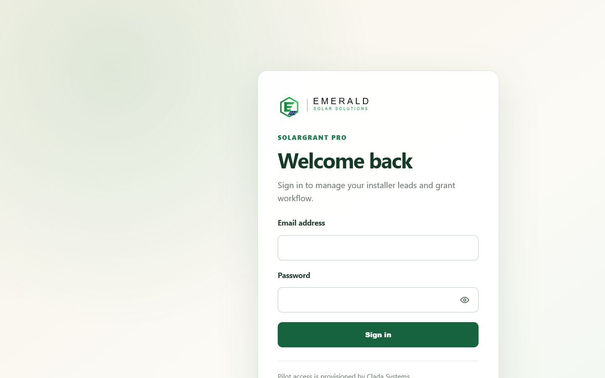
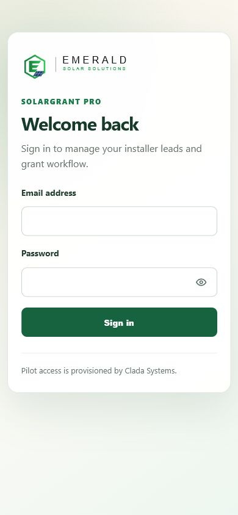
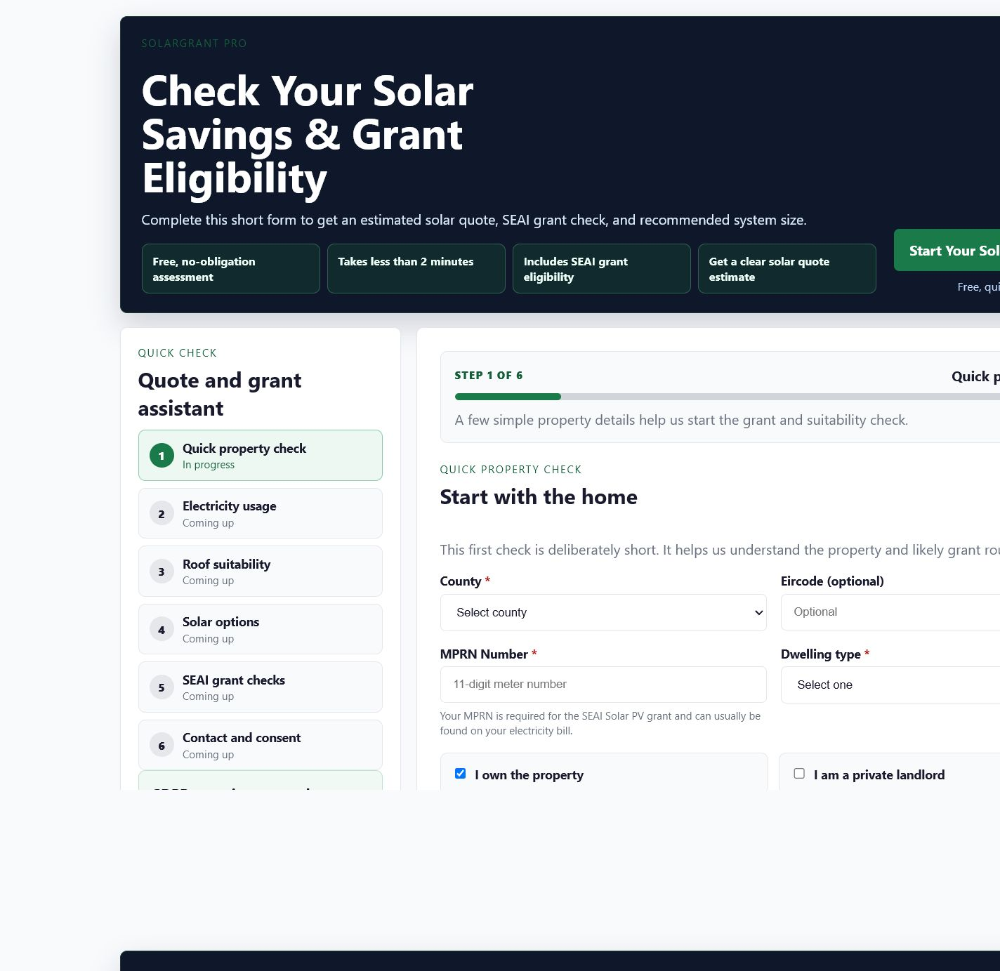
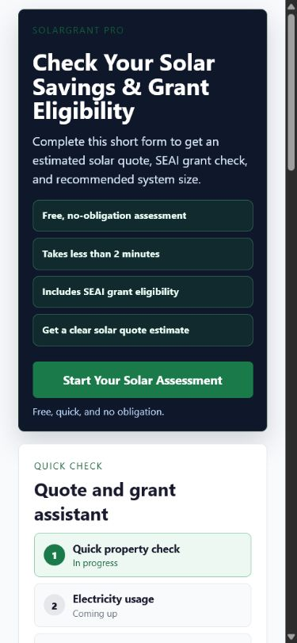
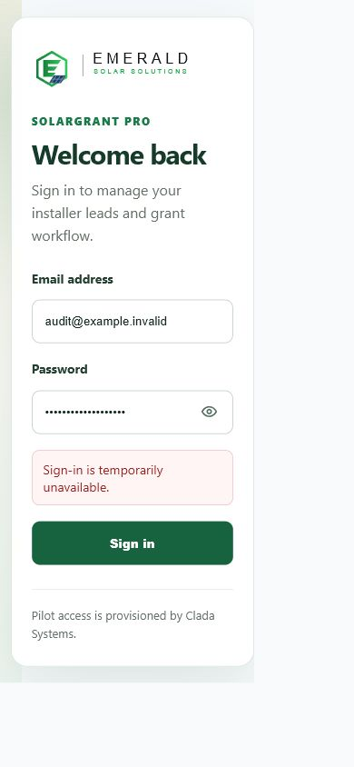

# SolarGRANT Pro Product and UX/UI Audit V1

| Field | Value |
| --- | --- |
| Document ID | PRODUCT-UX-AUDIT-SOLARGRANT-PRO-V1 |
| Status | Complete |
| Audit baseline | `93b37f007d80ca30079cd1d2bc99e2e10a317159` (`main`) |
| Audit date | 17 July 2026 |
| Pilot horizon | First 5–10 Irish residential solar installer pilots |
| Scope | Product, UX/UI, accessibility, responsive behaviour, routes, components, tests, and documented product intent |
| Decision | **Not ready for pilot invitation** |

## 1. Executive summary

### Overall product readiness

SolarGRANT Pro is a credible workflow prototype with a useful operational core, but it is **not ready to be the primary working system for pilot installers**. The strongest foundation is now materially beyond a mock-up: provisioned installer identities, organisation-scoped access, a homeowner intake, pipeline stages, lead scoring, follow-up dates, notes, activity history, document uploads, a customer portal, internal application packs, and transparent pricing settings all exist.

The immediate blocker is reliability. On 17 July 2026, the Production login page loaded, protected routes redirected correctly, but `POST /api/auth/login` returned HTTP 503 with `{"error":"Sign-in is temporarily unavailable."}`. A pilot cannot begin while the only operational entry point is unavailable.

After access is restored, the central usability problem is that the product records a large amount of information without yet supporting the minimum corrections and decisions an installer must make. An installer cannot create a normal CRM lead, correct core homeowner or property data, edit or recalculate a quote for a specific lead, approve and version a customer offer, or send a professional proposal. Follow-up exists as a date, but it is not a complete daily work queue.

The product should not be expanded broadly before the pilot. The shortest credible route is to make the existing vertical slice truthful, editable, reliable, and easy to resume: dependable login, real empty states, editable lead facts, a focused next-action queue, and a minimum customer-ready quote workflow.

### Strongest parts

- The public intake is structured, responsive, clearly labelled, and captures useful sales and grant-readiness signals in six steps.
- Pilot authentication and tenant context are substantially stronger than the earlier shared-admin implementation; protected routes redirect consistently and tests cover session and tenant boundaries.
- The lead detail page has a strong information base: contact, property, eligibility, quote, documents, notes, activity, portal access, stage controls, and audit evidence.
- The dashboard includes genuinely operational content: hot leads, due/stale follow-ups, recent activity, pipeline counts, and direct lead links.
- The customer portal and document checklist provide real administration value through upload, review status, replacement requests, and secure tokenised access.
- The visual direction is calm and credible: restrained green, off-white surfaces, clear panels, and generally consistent status treatments.

### Biggest usability risks

1. The dashboard displays synthetic sample leads and a fallback count of six tracked counties when there is no real data. This makes an operational system untrustworthy at the exact moment a new pilot evaluates it.
2. Core lead data is read-only after intake, so installers must work around mistakes outside the product.
3. The lead page is extremely long and repeats quote, property, grant, notes, and summary information. The top summary helps, but primary actions are diluted by internal exports and administrative controls.
4. The quote experience shows both an indicative grant-adjusted estimate and an installer-generated total without a clear customer-offer lifecycle. Neither can be edited per lead.
5. Follow-up dates are not visible or filterable in the all-leads table, and the dashboard shows only five follow-ups without the due date or reason.
6. Mobile authenticated workflows rely on horizontal tables and pipeline strips; the top bar and summary sidebar stack above the work, pushing priorities below the fold.

### Biggest commercial risks

- A pilot user can be locked out by an unavailable sign-in service.
- Fake empty-state data can destroy trust in counts, reporting, and tenant isolation.
- A lead cannot be corrected or manually entered, encouraging immediate spreadsheet duplication.
- The product cannot produce a versioned, branded, customer-ready quote or proposal, so it does not yet replace a material part of the installer's sales workflow.
- Branding is inconsistent: SolarGRANT Pro, Clada OS, an Emerald Solar Solutions logo, and `support@emeraldsolutions.ie` appear across the same journey.
- The homeowner county list includes Northern Ireland counties even though the SEAI domestic Solar PV scheme requires the home to be in the Republic of Ireland. The current [SEAI Solar Electricity Grant terms](https://www.seai.ie/sites/default/files/grants/home-energy-grants/individual-grants/solar-electricity-grant/Solar-PV-Terms-And-Conditions.pdf) explicitly state that requirement.

### Recommended focus before pilot onboarding

1. Restore and smoke-test Production login and authenticated navigation.
2. Remove all synthetic operational data and correct misleading metrics.
3. Add manual lead creation and editing of core contact, property, and qualification facts, with recalculation where those facts affect eligibility or estimates.
4. Create a minimum per-lead quote workflow: editable inputs, explicit grant line, saved version/status, approval state, and professional PDF/print output.
5. Turn follow-up into a visible work queue with due/overdue states on the dashboard and lead list.
6. Validate Republic-of-Ireland eligibility at intake and simplify the authenticated mobile experience.

## 2. Audit method and evidence

The audit combined:

- Direct browser inspection of the current Production deployment at desktop (`1440 × 900`) and mobile (`390 × 844`) widths.
- Route-protection checks for `/admin`, `/admin/support`, `/admin/dashboard`, `/admin/leads`, `/installer-review-emerald`, `/installer-review-emerald/leads`, and `/installer-review-emerald/quote-pricing`.
- A controlled invalid-login check using non-customer dummy data; the endpoint returned HTTP 503 rather than the expected generic authentication rejection.
- DOM inspection for labels, headings, control names, overflow, control sizes, error semantics, and responsive page dimensions.
- Repository review of current routes, components, workflow actions, Prisma models, documentation, migrations, and unit/integration tests.
- Review of the existing authenticated shell evidence in `docs/screenshots/td-017-td-018/` from the current baseline.

No real customer data, credentials, tokens, database values, or environment secrets were captured.

### Browser evidence

### Inspection limitation

Authenticated Production content could not be inspected with a live pilot account because no audit credential was provided and the login endpoint returned HTTP 503. Authenticated UI findings therefore combine direct route/redirect inspection, current source, current tests, and the repository's current authenticated-shell screenshot. Before inviting a pilot, repeat the desktop and mobile journey with a provisioned non-production pilot account and realistic seeded leads.

## 3. Product readiness scorecard

| Area | Score | Rationale |
| --- | ---: | --- |
| Navigation | 3/5 | Four top-level items are understandable, but duplicate legacy routes, a redundant sidebar Dashboard link, a second floating Support action, and a bespoke lead-detail shell weaken consistency. |
| Dashboard | 2/5 | Hot leads, follow-ups, activity, and pipeline data are useful; duplicated pipeline visualisations, misleading metrics, synthetic leads, and fake fallback counts prevent operational trust. |
| Lead management | 2/5 | Scanning, stages, notes, documents, and a rich detail view exist, but there is no normal manual create, core edit, search, meaningful sort, structured owner, or complete next-action view. |
| Quote workflow | 2/5 | Pricing assumptions and a stored generated snapshot exist, but per-lead editing, recalculation, versioning, approval, and customer-ready delivery are missing. |
| Documents | 3/5 | Portal uploads, review statuses, replacement handling, downloads, and an internal pack are useful; there is no branded proposal and several exports expose internal implementation language. |
| Follow-up workflow | 2/5 | A date, stale-lead heuristic, dashboard list, and activity evidence exist; the work is not visible in the lead list, limited to five items on the dashboard, and lacks a structured next action or completion loop. |
| Mobile usability | 2/5 | Login and public intake avoid viewport overflow, but authenticated navigation stacks heavily, the work summary precedes content, and key tables/pipelines remain 780–980 px horizontal canvases. |
| Accessibility | 3/5 | Login labels, button names, role-alert feedback, document input names, heading structure, and global focus styles are good; small checkboxes, dense tables, weak custom pricing focus, absent route error UI, and incomplete progress semantics remain. |
| Visual consistency | 3/5 | The light operational design is calm and credible; mixed brands, mixed route shells, legacy dark/light styles, dense detail content, and inconsistent terminology reduce polish. |
| Pilot readiness | 2/5 | The data and workflow foundation is promising, but unavailable sign-in, uneditable records, fake empty states, and the incomplete customer quote loop block safe pilot use. |

## 4. Current product map

### Main user journeys

| Journey | Current path | Outcome |
| --- | --- | --- |
| Homeowner enquiry | `/` or `/embed` → six-step intake → `/api/intake` | Creates or matches a lead, evaluates grant signals, calculates estimates, stores an installer-priced quote snapshot, and triggers optional notifications. |
| Installer login | `/login` → `/api/auth/login` → requested protected route | Provisioned user receives an opaque session and organisation context. Currently blocked in Production by HTTP 503. |
| Daily review | `/admin/dashboard` | Shows KPIs, two pipeline summaries, hot leads, follow-ups, activity, recent leads, and sidebar metrics. |
| Lead review | `/installer-review-emerald/leads` → `/installer-review-emerald/leads/[id]` | Scans leads, changes stage, reviews the full record, adds notes, schedules follow-up, reviews documents, and opens exports/portal. |
| Quote configuration | `/admin/dashboard/quote-pricing` | Edits global cost assumptions and previews one fixed example; changes affect new homeowner quotes. |
| Document preparation | Lead detail → application pack, print summary, JSON, portal-fill preview | Supports internal manual preparation and copy/export, not a customer proposal. |
| Homeowner aftercare | `/portal/[token]` | Shows status, document counts, project stages, uploads/replacements, and secure downloads. |
| Support | `/admin/support` or floating `?` | Gives an email action and troubleshooting instructions. |

### Pages and routes

| Surface | Canonical route | Notes |
| --- | --- | --- |
| Public intake | `/`, `/embed` | Duplicated entry pages around the same form. |
| Legal | `/privacy`, `/terms`, `/data-protection` | Public supporting content. |
| Login/logout | `/login`, `POST /logout` | `/admin` also redirects to login/dashboard. Legacy `/admin/logout` remains referenced in lead detail. |
| Dashboard | `/admin/dashboard` | Renders `app/installer-review-emerald/page.tsx`; `/installer-review-emerald` is a second route to the same product area. |
| Leads | `/installer-review-emerald/leads` | `/admin/leads` redirects here. |
| Lead detail | `/installer-review-emerald/leads/[id]` | Uses a separate page shell rather than `DashboardShell`. |
| Quote settings | `/admin/dashboard/quote-pricing` | `/installer-review-emerald/quote-pricing` redirects here. |
| Support | `/admin/support` | Uses `DashboardShell`. |
| Application pack | `/admin/dashboard/leads/[id]/application-pack` and `/print` | `/admin/leads/[id]/application-pack` routes redirect to the dashboard route. |
| Customer portal | `/portal/[token]` | Tokenised public workflow with document routes. |

### Navigation and actions

Primary navigation currently contains Dashboard, Leads, Quote Pricing, and Support. The left sidebar repeats Dashboard and displays Tracked Counties, Open Blockers, and Liability Leads. A floating `?` repeats Support.

Primary operational actions are Open intake, Open Lead, Call Now, Update stage, Save follow-up, Add Note, review document status, and save pricing settings. Secondary actions include copy summaries, open/print application packs, JSON exports, portal-fill preview, copy/regenerate the portal link, mark workflow states, and erase homeowner data.

### Unfinished, duplicated, unclear, or low-value areas

- `/admin/**` and `/installer-review-emerald/**` are mixed throughout user-facing URLs and internal links.
- The dashboard renders both stage summary cards and a full horizontal CRM pipeline with the same counts.
- The lead detail repeats an operational summary, quote facts, property/roof/usage/grant facts, and audit/history in multiple formats.
- `InstallerLeadTable` and `RecentLeadsTable` overlap in purpose but provide different filters and empty-state behaviour.
- “Open intake” is not an installer lead-create action; it sends staff through the homeowner journey.
- “Quote Pricing” is global configuration, but its position implies a daily quoting workspace.
- “SEAI Approvals” counts submitted or completed records, not verified approval events.
- Internal labels such as “Application pack JSON”, “Portal fill preview”, “CRM pipeline”, “pipeline stage”, and “liability leads” are visible to installers.

## 5. Installer journey audit

| Step | What works | Confusing or unnecessary effort | Missing | Abandonment or trust risk |
| --- | --- | --- | --- | --- |
| 1. Log in | Calm layout; explicit labels; password visibility control; loading state; generic errors; protected routes preserve `next`. | No recovery or operator contact path is available on the page. Product title metadata still says “SEAI Solar Grant Checker”. | Reliable Production endpoint, password reset or at least a pilot support path. | Production returned 503, making the product unusable. |
| 2. Review new leads | Dashboard exposes hot leads, follow-up-needed leads, recent activity, and pipeline data. | Three stage/count treatments compete; sidebar metrics appear before work on narrow screens. | A truthful first-use state and a single prioritised work queue. | Synthetic leads and county counts make all dashboard data suspect. |
| 3. Open a lead | Tables link directly; call action exists; stage is visible. | All-leads table has no search, next follow-up, overdue reason, owner, quote status, or document readiness. | Search, due filter, owner, sortable last activity/created date, and mobile cards. | Installer returns to email/spreadsheet to find the right record. |
| 4. Understand homeowner/property | Lead header and first cards expose stage, score, contact, property, grant signals, and recommended action. | Six simultaneous chips and repeated summaries increase scan time. Header prioritises pack/print over call, email, edit, and next action. | Edit core facts, visible provenance, and a condensed ten-second summary. | A typo or changed circumstance cannot be corrected, so users mistrust derived results. |
| 5. Check grant eligibility | Missing items, risks, confidence, works-started, prior-grant, ownership, and disclaimers are visible. | “Grant likely” can appear alongside heuristic confidence and two quote representations; it can look more authoritative than intended. | Re-run eligibility after edits; Republic-only validation; explicit “estimate, not SEAI approval” adjacent to every customer-facing value. | Northern Ireland county intake can produce a misleading SEAI journey. |
| 6. Prepare/update quote | Global cost categories are transparent; fixed preview updates immediately; intake stores pricing timestamp and component totals. | Global settings are reached from a lead, but the page says changes affect new quotes only. Commercial estimate and generated total may conflict. | Per-lead edit, recalc, extras, grant line, notes, status, versions, approval, and final output. | Installer must duplicate the quote elsewhere and may send the wrong figure. |
| 7. Follow up | Click-to-call/mail links, notes, follow-up date, activity entries, and portal link exist. | Due date is absent from the lead table and dashboard item; there is no follow-up outcome or communication composer. | Structured next action, due/overdue reason, completion/reschedule, and a lightweight communication log. | Follow-ups are missed or recorded in a second tool. |
| 8. Move pipeline | Inline and detail stage controls exist with permission validation and workflow history. | Multiple status systems—pipeline stage, grant status, lead score, lead temperature, application status—compete. Inline update requires select plus button per row. | Clear separation of sales stage, grant readiness, and quote status; transition feedback. | Users choose the wrong control or cannot tell what changed. |
| 9. Generate documents | Internal pack, print view, structured data, portal uploads, document review, and replacement states exist. | Four export actions include implementation-facing JSON/preview language. Pack is internal manual prep, not a proposal. | Branded customer quote/proposal, version and approval metadata, safe download/delivery. | Product appears unfinished at the customer-facing moment. |
| 10. Return later | Dashboard follow-up heuristic, activity, last-activity timestamps, and stage/history help. | Dashboard shows only five follow-ups, lacks due date/reason, and uses recency rather than a complete task model. | “My work today” queue with overdue, today, upcoming, quote awaiting response, and missing documents. | Installer cannot trust the app as the daily operating system. |

### Ten-second lead test

The lead can be partially understood within ten seconds because the header and four KPIs show name, stage, score, system size, quote estimate, grant signal, and timeline. It does **not** pass the complete ten-second test because owner, overdue status, exact next follow-up, quote status, missing-document count, and the most important contact action are not presented as one coherent decision block. The page then expands into more than twenty cards/sections and repeats several data sets.

## 6. Dashboard audit

### Useful content

- Hot leads and Follow-up needed are aligned with daily installer work.
- Recent Activity provides useful cross-lead context.
- Active Pipeline is a useful headline count.
- Pending Docs can be useful if derived from the actual required-document checklist.
- Recent leads supports quick re-entry and stage updates.

### Decorative, redundant, or misleading content

- `PipelineSummaryCards` and `PipelineWorkflow` visualise the same stage counts; keep one compact, interactive version.
- “SEAI Approvals” is not backed by an approval event; submitted/completed is not the same as approved.
- “Tracked Counties” has weak daily value and falls back to six when zero.
- “Liability Leads” is internal/risk-heavy language and provides no drill-down.
- Letter icons (`P`, `H`, `OK`, `D`) add little meaning.
- Sample leads are rendered as operational rows when the organisation has no leads.

### Priority visibility

The dashboard finds overdue/stale leads, but each row shows last activity rather than the follow-up due date and reason. Quotes awaiting a homeowner response are not a dedicated priority because quote status is not modelled. Missing documents are only a count and cannot be opened as a filtered work list. The primary “Open intake” action solves the wrong user need: staff require a short manual lead-entry flow.

### Empty, loading, and error states

- Empty hot/follow-up/activity panels have clear copy.
- The main table substitutes sample leads instead of showing an empty state.
- The loading page uses a legacy visual shell and wording, so it will visibly jump into the modern authenticated shell.
- There is no route-level error UI for database/query/server-action failure.
- Server actions commonly throw `Error`, leaving no calm, recoverable inline feedback contract.

## 7. Navigation audit

The labels Dashboard and Leads are clear. Quote Pricing should be renamed and moved under Settings because it configures global assumptions rather than opening a quote. Support can remain available in one place, not both the top navigation and floating bubble.

Recommended pilot navigation order:

1. Today
2. Leads
3. Settings
4. Help

“Today” should remain the dashboard route but use work-oriented language. Documents do not yet need a top-level route; document readiness should be exposed through filters and lead detail until pilot evidence shows a separate queue is necessary.

The lead detail should use the same authenticated shell. Current bespoke Back to leads and Log out links remove the main navigation and create a discontinuity. Legacy `/installer-review-emerald` naming should remain only as compatibility redirects and be removed from visible/internal canonical links.

On screens below 1100 px the header becomes three rows, account details are retained, the sidebar becomes a full-width block, and top navigation scrolls horizontally. On phones this consumes a large portion of the first screen before the current task. A compact mobile header/menu and work-first content order are required.

## 8. Lead management audit

### Scanning, search, and filtering

The all-leads table shows applicant, location, stage, score, last activity, eligibility, open, and call actions. This is a solid base. Filters cover Hot and five early stages but omit Warm, Cold, Survey Completed, Won, Lost, due/overdue follow-up, missing documents, quote sent/awaiting response, and owner. There is no search or user-selectable sort. At 200 records, scanning becomes the bottleneck before query performance does.

### Ownership and next action

Assignee fields are free text, hidden on detail, and absent from the table. They do not map to organisation memberships. The recommended next action is computed copy rather than a saved, ownable task. For the first 5–10 pilots, a full task platform is unnecessary; a structured next action, due date, owner, and complete/reschedule action is sufficient.

### Editing and duplicate entry

Core lead facts are display-only. The Review controls form edits grant/admin workflow metadata and research fields, not the homeowner's name, phone, email, address, MPRN, property type, roof, usage, or grant answers. Manual lead creation is absent. These two gaps guarantee duplicate entry because staff will maintain corrections and phone enquiries elsewhere.

### Notes and history

Private notes, activity timeline, workflow history, and audit history are valuable. However, activity and audit are separated, and the page repeats operational history in multiple sections. Present one installer-facing timeline and keep low-level audit metadata out of the default view.

### Stage transitions

The permission and workflow foundation is strong. The UX needs success/error feedback and fewer competing status concepts. Use:

- Sales stage: where the opportunity is.
- Quote status: draft, sent, accepted, declined, expired.
- Grant readiness: incomplete, review needed, ready, submitted, approved/completed.

Lead score and temperature currently overlap; retain one customer-priority signal for the pilot.

## 9. Quote workflow audit

### What works

- Global pricing exposes equipment, labour, adjustments, markup, VAT, discount, travel, and minimum price.
- A live preview demonstrates the formula.
- Generated snapshots store component totals, system size, panel count, generation timestamp, and pricing update timestamp.
- The estimate separately explains gross range, grant deduction, net range, savings, and payback.

### Pilot risks

- A stored quote cannot be edited or recalculated for an existing lead.
- Pricing settings changed from a lead affect only future intake quotes, which is easy to misunderstand.
- There is no quote model with versions; a JSON snapshot inside the lead is not a manageable commercial record.
- There is no draft/sent/accepted/declined/expired state.
- There is no installer approval step before customer use.
- No branded PDF/proposal is generated or persisted.
- Two quote representations can show different totals without explaining which one is the proposed price.
- Reset to defaults is a state-changing pricing action without a confirmation step.
- Validation failures from the server action do not have a designed inline error state.

### Minimum quote improvements for pilot use

1. One canonical customer quote per active version.
2. Editable system size, panel count, battery/extras, labour/adjustment, discount, and notes.
3. Explicit subtotal, VAT, grant estimate, and customer net price with clear eligibility disclaimer.
4. Recalculate from current settings with a visible “pricing basis” timestamp.
5. Draft → approved → sent → accepted/declined status.
6. Version history that preserves sent figures.
7. Branded, professional print/PDF output and secure installer download.

This is the smallest quote slice that can replace a spreadsheet or separate quoting tool. Automated email delivery, e-signature, financing, catalogue management, and advanced margin approval should wait.

## 10. Documents and customer portal audit

The document workflow is one of the more pilot-valuable areas. It has required/optional checklist semantics, uploaded metadata, status, installer approval/rejection/replacement, secure downloads, and a homeowner upload flow. The portal shows project status and document counts in calm, homeowner-friendly language.

Remaining problems:

- The “Application Pack” is an internal manual-assist summary, not the promised customer proposal.
- “Application pack JSON” and “Portal fill preview” are engineering/operations tools exposed as normal lead actions.
- The portal link is a raw token URL; regeneration has no confirmation and should clearly warn that the old link will stop working.
- Portal branding uses a `CO` placeholder plus installer name, while login uses the Emerald logo and authenticated navigation uses Clada OS.
- Homeowners cannot see the agreed quote, contact details, or a precise next step/expected response time.

For the pilot, keep JSON/preview utilities behind an internal or secondary disclosure. Add the customer quote and a clear “what happens next” message before adding portal messaging or e-signature.

## 11. Visual design audit

### Typography and hierarchy

The system font stack and restrained sizes feel operational. The login hierarchy is particularly strong. The authenticated dashboard uses many 11–13 px labels and dense status chips; this is acceptable on desktop but fragile on mobile and for field use. Lead detail headings are consistent locally, but the volume of cards removes meaningful hierarchy.

### Spacing, alignment, density, and cards

Spacing and eight-pixel-radius panels support the desired established-B2B direction. Density is too high in lead detail and pricing. The global pricing form exposes 21 numeric inputs before the actions, while lead detail exceeds 1,200 source lines and places operational, customer, internal, research, audit, and erasure controls on one page.

### Colour and contrast

The green, slate, off-white, amber, and blue palette is calm and generally readable. Status meaning is not colour-only because labels accompany colour. Global focus outlines are present. The pricing input override removes the global outline and uses a pale two-pixel inset blue on a dark legacy background; this should be tested and strengthened against WCAG focus appearance expectations.

### Tables and forms

Tables are visually clean but force horizontal scrolling at mobile widths. Forms generally use real labels. Button hierarchy is less consistent: application-pack/print actions look primary on lead detail, destructive erasure shares the same long page, and several server actions have no pending/success/error component.

### Brand and terminology

The desired direction is undermined by four identities: “Clada OS”, “SolarGRANT Pro”, “SOLARgrant Pro”, and “Emerald Solar Solutions”. The page title remains “SEAI Solar Grant Checker”; Support uses an Emerald address. Choose a pilot hierarchy such as “SolarGRANT Pro by Clada Systems”, then let installer branding appear only in homeowner outputs.

## 12. Mobile and responsive audit

At 390 px the login page had no horizontal overflow; inputs were 321 × 48 px and the submit action was 321 × 48 px. The public intake also had no page-level overflow and form fields were 289 × 42 px. However, the full first-step intake page measured 3,285 px high because marketing, progress, form, benefits, and footer content stack into one long page. The native checkbox itself measured 13 × 13 px; the associated label may enlarge the clickable row, but the visible target is too small.

Authenticated CSS reveals the more important issues:

- The four-link top navigation scrolls horizontally.
- Brand, navigation, and account stack into separate rows.
- The full sidebar summary appears before the main work.
- The leads table has a minimum width of 780 px.
- The pipeline has a minimum width of 980 px.
- Lead detail collapses nearly every card and button to full width, producing an exceptionally long page.

Pilot mobile work should optimise for review, call, note, follow-up, and stage change. Replace the table with a card/list treatment at phone widths, use a compact header, put today’s work first, and collapse secondary lead sections.

## 13. Accessibility audit

### Positive findings

- Login inputs have explicit labels, autocomplete attributes, required state, and a named password toggle.
- Login failure uses `role="alert"`; the submit action exposes `aria-busy` and disabled state while pending.
- Protected route redirects do not leak content.
- Public intake labels and error associations use `aria-invalid`/`aria-describedby`.
- The document file input has a context-specific accessible name.
- Global `:focus-visible` styles exist for links, buttons, inputs, selects, and textareas.
- Decorative status icons are usually hidden from assistive technology.

### Gaps

- The public six-step indicator is exposed as generic content rather than a semantic progress indicator with current-step state.
- Visible checkbox controls are small on mobile.
- Authenticated data tables lack captions or a compact alternative; horizontal exploration is difficult with zoom and screen readers.
- The custom quote-pricing focus treatment overrides the global outline with a subtle inset shadow.
- Many actions rely on full-page server transitions and thrown errors instead of named inline status regions.
- The recent-leads table has no explicit empty-state row and no announcement when filters produce zero results.
- The floating `?` control is named, but duplicates the top-level Support destination.
- Dense, repeated headings on lead detail make landmark navigation laborious.
- There is no documented reduced-motion treatment; smooth scrolling is globally enabled.

### Required accessibility validation before pilot

Complete keyboard-only journeys for login, lead filters, open/call, stage update, follow-up, note, document review, pricing save, and logout. Test at 200% zoom and 390 px. Run an automated accessibility scan on login, dashboard, leads, one complete lead, quote pricing, application pack, and portal, then manually verify names, focus order, error recovery, and status announcements.

## 14. Findings table

Effort uses XS (hours), S (1–3 days), M (up to two weeks), and L (multi-PR or more than two weeks).

| ID | Area | Severity | Finding | User impact | Business impact | Recommendation | Effort | Pilot blocker |
| --- | --- | --- | --- | --- | --- | --- | --- | --- |
| PUX-001 | Login/reliability | Critical | Production `POST /api/auth/login` returned HTTP 503 during the audit. | Installer cannot enter the product. | Pilot cannot operate or be demonstrated reliably. | Fix environment/runtime configuration, add a deployment smoke test, and verify with a provisioned pilot account. | S | Yes |
| PUX-002 | Dashboard | Critical | Empty organisations receive three synthetic leads and fallback “6” tracked counties. | User cannot distinguish real from demo data. | Destroys trust in tenant isolation, reporting, and commercial credibility. | Remove runtime sample data and all non-zero metric fallbacks; use honest onboarding empty states. | XS | Yes |
| PUX-003 | Lead management | High | No normal manual lead creation exists; Open intake launches the homeowner form. | Phone/referral leads require duplicate entry or a poor six-step flow. | Product cannot become the pilot system of record. | Add a short installer lead-create form with only contact/source/next-action essentials. | M | Yes |
| PUX-004 | Lead detail | High | Core homeowner, address, MPRN, property, roof, usage, and grant answers cannot be edited. | Mistakes and changed facts remain wrong. | Derived eligibility/quote errors and spreadsheet workarounds. | Add auditable core editing and rerun affected eligibility/estimate calculations. | M | Yes |
| PUX-005 | Quote | High | Quotes are read-only per lead and global pricing changes affect only new intake snapshots. | Installer cannot prepare a real offer. | Product does not replace quoting work and increases error risk. | Add lead-specific editable quote inputs and explicit recalculation. | M | Yes |
| PUX-006 | Quote/proposal | High | No versioned, approved, branded customer quote/PDF exists. | Installer must leave the product to send an offer. | Weak customer experience and no conversion evidence. | Implement the minimum quote lifecycle and customer-ready PDF/print output. | L | Yes |
| PUX-007 | Grant eligibility | High | Intake offers Northern Ireland counties although the domestic SEAI Solar PV grant requires a Republic of Ireland home. | Ineligible homeowners can enter a grant-led journey. | Misleading claims, wasted installer time, and trust/compliance risk. | Restrict eligible counties or branch unsupported locations before any grant estimate. | S | Yes |
| PUX-008 | Dashboard metrics | High | “SEAI Approvals” counts submitted/completed; Pending Docs uses a coarse zero-upload/status heuristic. | Installer receives inaccurate operational meaning. | Decisions and pilot value claims rely on misleading metrics. | Rename or calculate from authoritative events/checklist states and make cards drillable. | S | Yes |
| PUX-009 | Follow-up | High | Due date/reason is absent from dashboard rows and lead list; dashboard is capped at five. | Work can be missed and backlog cannot be cleared. | Lower response speed and conversion. | Add due/overdue columns/cards, complete queue, and one-click complete/reschedule. | M | Yes |
| PUX-010 | Lead list | High | No search, meaningful sort, owner filter, due filter, document readiness, or quote status. | Finding and prioritising records becomes slow. | Productivity degrades quickly as lead volume grows. | Add server-backed search plus a small set of saved operational filters. | M | No |
| PUX-011 | Lead detail | High | The page repeats summaries and mixes daily work, grant admin, sales research, audit, exports, portal, and erasure. | Ten-second comprehension becomes scroll-heavy and error-prone. | Onboarding and support burden rise. | Keep a compact decision header; group secondary content into clear tabs/accordions or subroutes. | M | No |
| PUX-012 | Status model | High | Pipeline stage, lead score, lead temperature, application status, grant likelihood, and quote signals compete. | User may update or interpret the wrong state. | Reporting and workflow adoption become inconsistent. | Define and label three distinct tracks: sales stage, quote status, grant readiness; remove duplicate priority signal. | M | No |
| PUX-013 | Assignment | Medium | Assignees are free text, not membership-backed, and invisible in lists. | Teams cannot see who owns follow-up. | Missed work and weak accountability. | Use active organisation members as a simple owner select and expose it in work views. | M | No |
| PUX-014 | Dashboard | Medium | Pipeline summary cards and pipeline workflow repeat the same stage counts. | Adds scrolling without a new decision. | Makes the product feel dashboard-heavy rather than operational. | Keep one compact, clickable stage summary. | S | No |
| PUX-015 | Navigation | Medium | Canonical routes mix `/admin` and `/installer-review-emerald`; lead detail drops the main shell. | Navigation feels inconsistent and backtracking increases. | Product appears unfinished and is harder to maintain. | Canonicalise links under one installer route family and use the shared shell everywhere. | M | No |
| PUX-016 | Navigation | Medium | Quote Pricing is a top-level daily item; Support is duplicated in nav and a floating bubble; sidebar repeats Dashboard. | Navigation consumes space and overstates low-frequency actions. | Mobile header becomes bulky and onboarding less clear. | Move pricing into Settings, keep one Help entry, and remove duplicate sidebar navigation. | S | No |
| PUX-017 | Mobile | High | Authenticated tables/pipeline require 780–980 px horizontal scrolling and the header/sidebar stack before work. | Field users cannot quickly review and act on a phone. | Weak adoption by installers away from a desk. | Add mobile lead cards, compact navigation, and work-first ordering. | M | Yes |
| PUX-018 | Error states | High | No route-level authenticated error UI; server actions throw errors without designed recovery feedback. | Failures can become error pages or ambiguous no-op experiences. | Support burden and loss of confidence. | Add route error boundaries and consistent inline pending/success/error patterns. | M | Yes |
| PUX-019 | Loading states | Medium | Dashboard loading UI uses a legacy shell and copy, unlike the final authenticated layout. | Layout jumps and product appears inconsistent. | Reduces perceived quality on slower connections. | Build skeletons inside the current shell and preserve layout dimensions. | S | No |
| PUX-020 | Empty states | Medium | All-leads `RecentLeadsTable` renders an empty table body; filtered states vary by component. | First-time users receive little guidance. | Slower onboarding and more support questions. | Standardise truthful empty/filter-empty states with one relevant action. | S | No |
| PUX-021 | Quote settings | High | Reset to defaults has no confirmation; save/reset validation has no inline recovery; 21 fields are equally prominent. | Accidental pricing changes and input mistakes are hard to recover from. | Direct commercial pricing risk. | Confirm reset, show field errors, group advanced costs, and record/display change summary. | M | Yes |
| PUX-022 | Quote clarity | High | Indicative grant-adjusted estimate and installer total are both prominent without one canonical offer. | Installer may copy or send the wrong number. | Margin, trust, and misquotation risk. | Label estimate vs customer quote clearly and designate one approved offer. | S | Yes |
| PUX-023 | Documents | Medium | JSON and portal-fill preview are presented as normal installer export cards. | Internal/technical concepts distract from the job. | Product looks like an engineering tool. | Hide under an internal/advanced disclosure; prioritise quote/proposal and readiness. | XS | No |
| PUX-024 | Portal | Medium | Regenerating a portal token has no confirmation or explicit invalidation warning. | Installer can accidentally break a homeowner link. | Avoidable support and customer frustration. | Add confirmation, state the effect, and record the event in the timeline. | S | No |
| PUX-025 | Branding/copy | High | Clada OS, SolarGRANT Pro, SOLARgrant, Emerald logo/email, and “SEAI Solar Grant Checker” are mixed. | Users cannot tell who supplies the product or support. | Weak commercial credibility and customer-facing trust. | Define a pilot brand hierarchy and replace legacy names/support identity consistently. | S | Yes |
| PUX-026 | Accessibility | Medium | Mobile checkboxes render as 13 px controls; progress is not semantic; pricing focus is subtle. | Touch, keyboard, low-vision, and screen-reader use is harder. | Accessibility risk and reduced field usability. | Enlarge visible/checkable targets, expose current-step semantics, and strengthen focus treatment. | S | No |
| PUX-027 | Accessibility | Medium | Dense horizontal tables lack captions and a mobile/zoom alternative. | Screen-reader and magnified users expend more effort. | Excludes some users and increases navigation errors. | Add captions/context and switch to semantic cards below the table breakpoint. | M | No |
| PUX-028 | Support/onboarding | Medium | Login gives no recovery/support action; onboarding relies on external provisioning knowledge. | A blocked pilot cannot self-resolve or contact help quickly. | High-touch onboarding becomes slower. | Add a pilot support link and a concise first-login checklist after access. | S | No |
| PUX-029 | Homeowner intake | Medium | The first mobile page is 3,285 px high because promotional and form content fully stack. | Form completion feels longer than the stated two minutes. | Lower completion and lead volume. | Reduce repeated marketing around the active form on mobile and keep progress/action in view. | S | No |
| PUX-030 | Data safety UX | Medium | Erasure controls share the everyday lead page with no progressive disclosure. | Accidental or anxious interaction with a destructive action is more likely. | Data-loss and support risk. | Move erasure behind an explicit privacy/admin flow with confirmation and permission checks. | S | No |
| PUX-031 | Tests | Medium | Strong domain/auth tests exist, but no browser regression coverage for login, empty dashboard, lead work, quote settings, or mobile. | UX failures reach Production undetected. | Current 503 and fake-data risks can recur. | Add a small Playwright smoke suite using isolated pilot data and required viewport checks. | M | Yes |

## 15. Recommended product changes

### Remove

- Runtime sample leads and all fabricated metric fallbacks.
- One of the duplicate pipeline visualisations.
- Duplicate Dashboard, Support, and legacy-route navigation affordances.
- Internal JSON/portal-preview actions from the default installer view.
- One of lead score or lead temperature for pilot prioritisation.

### Simplify

- Lead detail into a decision header, customer/property, quote, grant/documents, and activity/workflow groups.
- Navigation into Today, Leads, Settings, and Help.
- Status language into sales stage, quote status, and grant readiness.
- Mobile intake by reducing promotional repetition around the active form.
- Quote settings by separating common costs from advanced adjustments.

### Improve

- Production login reliability and deployment verification.
- Dashboard metrics so each has an operational definition and drill-down.
- Search, sorting, operational filters, and truthful empty states.
- Follow-up visibility, ownership, completion, and rescheduling.
- Mobile lead scanning and authenticated navigation.
- Error, loading, success, confirmation, and accessibility patterns.
- Brand, support, and terminology consistency.

### Add

- Installer manual lead creation.
- Auditable editing of core lead facts with recalculation.
- A minimum per-lead quote lifecycle and branded PDF/print output.
- Structured next action with due date and owner.
- Republic-of-Ireland eligibility guard.
- Pilot onboarding checklist and a safe browser smoke-test fixture.

### Defer

- Full task/project management.
- Automated multichannel campaigns and a full inbox.
- E-signature, financing, payments, inventory, scheduling/dispatch, and accounting integrations.
- Organisation switching, custom roles, SSO, MFA, and enterprise administration beyond pilot safety needs.
- Advanced analytics, forecasting, AI copilots, and decorative reporting.
- Portal chat and complex homeowner self-service until quote/document usage is validated.

## 16. Prioritised roadmap

### Phase A — Pilot blockers

| Order | Outcome | Success measure |
| ---: | --- | --- |
| A1 | Reliable login and protected journey | Provisioned pilot can log in, refresh, navigate, and log out in Production and Preview; automated smoke test passes. |
| A2 | Truthful first-use experience | Zero real leads produces zero counts, no sample records, and a clear create/share-intake path. |
| A3 | Republic-only grant routing | Unsupported county cannot receive a likely-SEAI-eligible result; supported county flow remains clear. |
| A4 | Manual create and core lead edit | Installer can record a phone/referral lead and correct contact/property/grant facts once, without spreadsheet duplication. |
| A5 | Quote MVP | Installer can edit, approve, version, and print/download one branded customer quote with explicit grant treatment. |
| A6 | Daily work visibility | Every due/overdue follow-up is visible with date, reason, owner, and complete/reschedule actions. |
| A7 | Safe interaction states | Critical server actions have pending, success, validation, and recoverable error UI; pricing reset and portal regeneration are confirmed. |
| A8 | Mobile critical path | At 390 px an installer can find a lead, call, add note, schedule follow-up, and change stage without horizontal table use. |

### Phase B — Pilot quality improvements

- Consolidate lead detail information architecture and the shared authenticated shell.
- Add search, sort, owner, stage, document, and quote-status filters.
- Back assignment with organisation members.
- Standardise brand hierarchy and installer support identity.
- Improve portal next-step/contact copy and show the accepted quote.
- Finish keyboard, zoom, screen-reader, contrast, and tap-target fixes.
- Add guided onboarding and a small realistic demo/fixture mode that is visibly labelled and never mixed with live data.

### Phase C — Post-pilot

- Communication templates and logged email/SMS sending.
- Import/export after pilot lead-source evidence.
- E-signature and proposal acceptance.
- Installation scheduling and aftercare workflows.
- Integrations with accounting, supplier, calendar, or existing CRM systems selected from pilot evidence.
- Reporting, forecasting, and automation based on actual repeated installer decisions.

## 17. Top 10 recommendations

Scores are 1 (low) to 5 (highest). Effort is inverse: 5 means smallest effort.

| Rank | Recommendation | Customer value | Commercial value | Effort | Risk reduction | Pilot urgency | Why now |
| ---: | --- | ---: | ---: | ---: | ---: | ---: | --- |
| 1 | Restore Production login and add smoke coverage | 5 | 5 | 4 | 5 | 5 | No other value is reachable without access. |
| 2 | Remove synthetic leads and fallback metrics | 5 | 5 | 5 | 5 | 5 | Fastest trust-critical correction. |
| 3 | Add manual lead create and core lead editing | 5 | 5 | 2 | 5 | 5 | Prevents immediate spreadsheet duplication. |
| 4 | Deliver the minimum editable, versioned customer quote | 5 | 5 | 1 | 5 | 5 | Replaces a core sales task and reduces pricing errors. |
| 5 | Build a complete due/overdue follow-up queue | 5 | 5 | 3 | 5 | 5 | Directly improves response speed and conversion. |
| 6 | Enforce Republic-of-Ireland grant routing | 5 | 4 | 4 | 5 | 5 | Prevents misleading eligibility and wasted follow-up. |
| 7 | Make the mobile critical path work without horizontal tables | 5 | 4 | 2 | 4 | 5 | Installers need field access during the pilot. |
| 8 | Simplify lead detail around next action and customer facts | 4 | 4 | 3 | 4 | 4 | Reduces onboarding time and wrong-action risk. |
| 9 | Add search, operational filters, sort, and owner visibility | 4 | 4 | 3 | 4 | 4 | Maintains productivity as pilot lead volume grows. |
| 10 | Standardise brand, terminology, error, and confirmation patterns | 4 | 5 | 4 | 4 | 4 | Raises commercial confidence at every touchpoint. |

## 18. Recommended next PR sequence

Each PR should be narrow, independently reviewable, and include its own product acceptance evidence.

### PR 1 — `fix: restore pilot authentication runtime reliability`

- **Objective:** Make login dependable in Preview and Production.
- **Scope:** Resolve the 503 cause; verify required environment classification/fingerprint/pepper wiring; add login health/smoke coverage using a provisioned isolated fixture; document verification.
- **Why first:** All authenticated testing and pilot work depends on it.
- **Expected customer value:** Installers can access their workspace reliably.
- **Data model changes:** No expected change.
- **Migration:** No.

### PR 2 — `fix: make dashboard data and empty states truthful`

- **Objective:** Remove trust-breaking synthetic operational data.
- **Scope:** Delete sample leads and numeric fallbacks; correct metric definitions/labels; add honest empty states and links; keep one pipeline visualisation.
- **Why second:** Creates a safe baseline before onboarding or seeded UX tests.
- **Expected customer value:** Every number and record can be trusted.
- **Data model changes:** No.
- **Migration:** No.

### PR 3 — `fix: enforce Republic of Ireland grant routing`

- **Objective:** Prevent unsupported locations receiving an SEAI-led result.
- **Scope:** County validation, homeowner copy, eligibility tests, and clear unsupported-location outcome.
- **Why third:** Small, high-risk-reduction change at the top of the funnel.
- **Expected customer value:** More accurate qualification and less wasted installer follow-up.
- **Data model changes:** No expected change if county remains text.
- **Migration:** No.

### PR 4 — `feat: add installer lead creation and core detail editing`

- **Objective:** Let SolarGRANT Pro hold phone/referral leads and correct intake facts.
- **Scope:** Short create form; edit contact/property/qualification fields; audit activity; safe recalculation of affected eligibility/estimate data; validation and permissions.
- **Why fourth:** Makes the CRM usable as the record of truth before quote work builds on it.
- **Expected customer value:** Less duplicate entry and fewer incorrect quotes/grant checks.
- **Data model changes:** Probably no change; current Lead fields cover the minimum.
- **Migration:** No expected migration.

### PR 5 — `feat: add the installer follow-up work queue`

- **Objective:** Make every lead requiring attention visible and actionable.
- **Scope:** Due/overdue/today/upcoming views; due date and reason in lead list; complete/reschedule; owner display using existing membership context where possible.
- **Why fifth:** Converts corrected leads into a reliable daily workflow.
- **Expected customer value:** Faster response and fewer missed opportunities.
- **Data model changes:** Likely yes for structured next-action/outcome and membership-backed owner.
- **Migration:** Likely required.

### PR 6 — `feat: add editable lead quote drafts`

- **Objective:** Create one canonical commercial offer per lead.
- **Scope:** Quote entity/version, editable sizing/extras/adjustments, explicit grant line, recalculation, draft/approved status, immutable sent-version basis, permission and audit tests.
- **Why sixth:** Depends on trustworthy lead facts and enables the proposal output.
- **Expected customer value:** Faster, safer quoting inside one system.
- **Data model changes:** Yes; introduce quote/version/status records rather than extending lead JSON.
- **Migration:** Yes.

### PR 7 — `feat: generate branded customer quote PDFs`

- **Objective:** Produce a professional homeowner-facing offer.
- **Scope:** Pilot installer identity/branding fields, approved template, PDF/print render, secure storage/download, quote-version linkage, visual regression evidence.
- **Why seventh:** Builds on a stable quote record and the accepted document ADRs.
- **Expected customer value:** Professional customer experience and less manual document work.
- **Data model changes:** Yes for generated document metadata and minimal installer branding fields.
- **Migration:** Yes.

### PR 8 — `refactor: simplify lead detail and canonical installer navigation`

- **Objective:** Make the main record understandable within ten seconds.
- **Scope:** Shared shell; decision header; consolidated duplicate sections; canonical route links; secondary/internal actions moved out of the primary flow; no behaviour expansion.
- **Why eighth:** Uses the final create/follow-up/quote actions rather than redesigning twice.
- **Expected customer value:** Faster onboarding and fewer workflow mistakes.
- **Data model changes:** No.
- **Migration:** No.

### PR 9 — `feat: add lead search and operational filters`

- **Objective:** Keep scanning fast as pilot data grows.
- **Scope:** Server-backed search; sort; owner, stage, due, document, and quote filters; shareable query state; accurate empty states.
- **Why ninth:** Filter vocabulary should reflect the settled quote and follow-up models.
- **Expected customer value:** Less time finding work and records.
- **Data model changes:** No expected change; indexes may be justified by measured volume later.
- **Migration:** No expected migration.

### PR 10 — `fix: complete mobile and accessibility pilot hardening`

- **Objective:** Make the critical journey robust for field and assistive use.
- **Scope:** Compact mobile header; lead cards; work-first ordering; larger tap targets; semantic progress; focus/error/status improvements; keyboard/zoom/screen-reader checks; browser regression suite.
- **Why tenth:** Applies hardening to the settled pilot workflow rather than temporary layouts.
- **Expected customer value:** Reliable use on phones and by a wider range of users.
- **Data model changes:** No.
- **Migration:** No.

## 19. Existing tests and coverage assessment

The repository has meaningful unit and integration coverage for database safety, identity, pilot authentication, permissions, tenant isolation, workflow transitions/history, intake notifications, lead access, validation, and migration SQL. This is a strong safety foundation.

The major gap is end-to-end product evidence. Current tests do not protect the Production login response, truthful empty dashboard, manual lead corrections, follow-up visibility, quote lifecycle, mobile navigation, or accessible server-action feedback. A small isolated Playwright suite should cover those exact pilot promises rather than broad screenshot snapshots.

## 20. Pilot acceptance gates

Do not invite the first installer until all are true:

- A provisioned pilot can log in and complete the authenticated journey in Preview and Production.
- Empty organisations display no invented data.
- Republic-of-Ireland grant routing is enforced.
- Phone/referral leads can be created and core facts corrected.
- One lead can be quoted, approved, versioned, and exported as a customer-ready document.
- Every due follow-up is visible and can be completed/rescheduled.
- The phone-width critical path requires no horizontal table interaction.
- Critical actions have recoverable feedback and confirmation where needed.
- No cross-tenant/customer data appears in screenshots, logs, exports, or navigation.
- Lint, typecheck, unit tests, build, and the pilot browser smoke journey pass on the release commit.

## 21. Validation record

Application code was not changed to make any check pass. The local checkout contains a database URL without the required classification fingerprints, so the first build correctly failed closed during page-data collection. The build was rerun with a process-only blank/whitespace `DATABASE_URL`, matching CI's no-database build context; no environment file was edited and no database connection was made. All requested checks then passed. The local runtime emitted a Node engine warning because Node 24.14.1 was available while the repository declares Node 22.x.

| Check | Result |
| --- | --- |
| `pnpm lint` | Pass |
| `pnpm typecheck` | Pass |
| `pnpm test` | Pass — 79 tests |
| `pnpm build` | Pass — 21 static pages generated; dynamic routes compiled |
